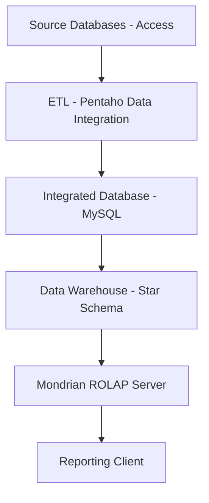

# Data warehouse project

## Project description

This project implements a decision support system for the company MoreMovies.
The company acquired three stores:

- MovieMegaMart
- BuckBoaster
- MetroStarlet

Each store has its own information system. The objective is to integrate these systems into a single data warehouse in order to analyze sales and rentals of movies and related products.

Two architectures must be implemented:

- Architecture 1: reporting tool connected directly to the MySQL data warehouse
- Architecture 2: reporting tool connected to the warehouse through a Mondrian ROLAP server

## System architecture



## Prerequisites

- Docker
- Docker Compose
- Visual Paradigm

## Project structure explanation

- **Adminer**: web-based database management tool to access the MySQL database,
- **Pentaho Data Integration**: ETL tool to extract data from Access databases and load it into MySQL,
- **Pentaho Server**: BI server to host the Mondrian ROLAP server and the reporting client.

### Adminer credentials

| Field    | Value       |
|----------|-------------|
| System   | MySQL       |
| Server   | mysql       |
| Username | root        |
| Password | root        |
| Database | database    |

## Start the infrastructure

```bash
docker compose up -d
```
