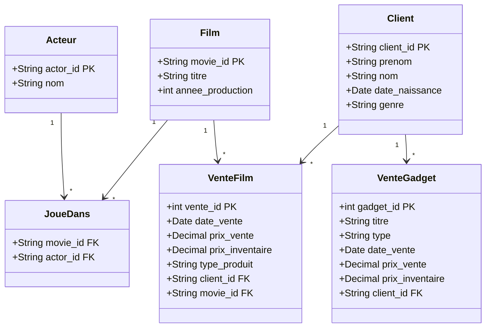
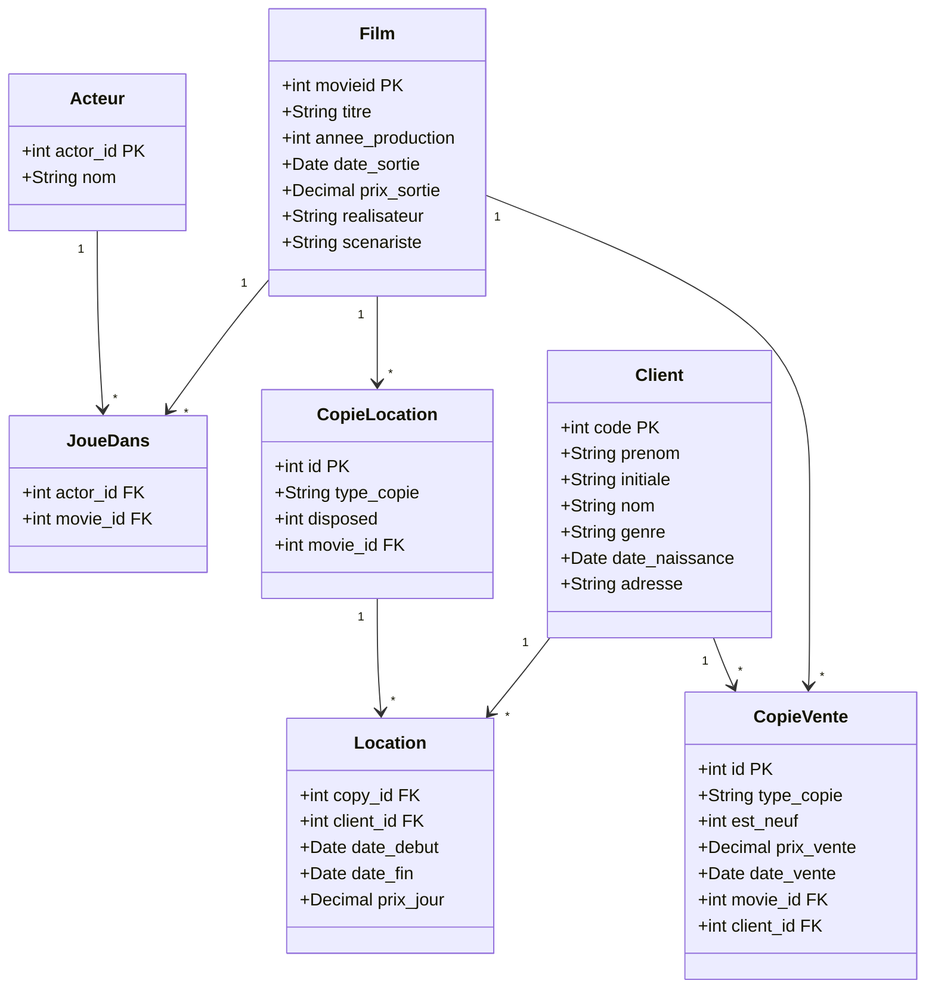
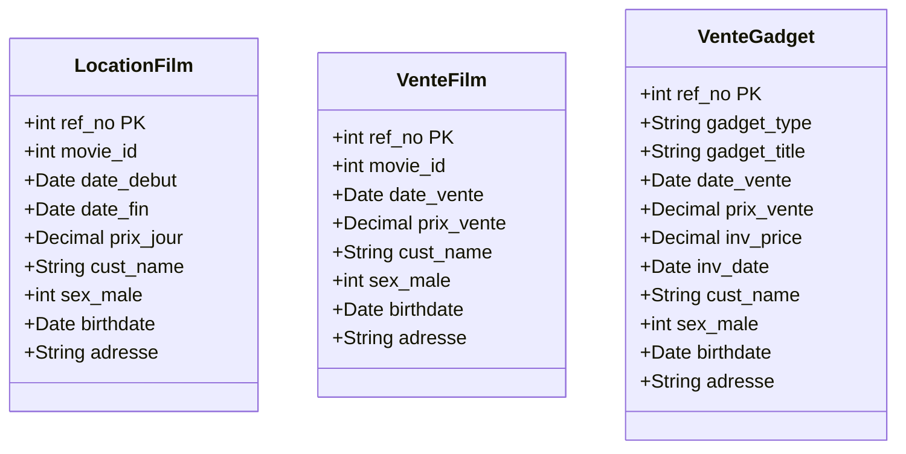
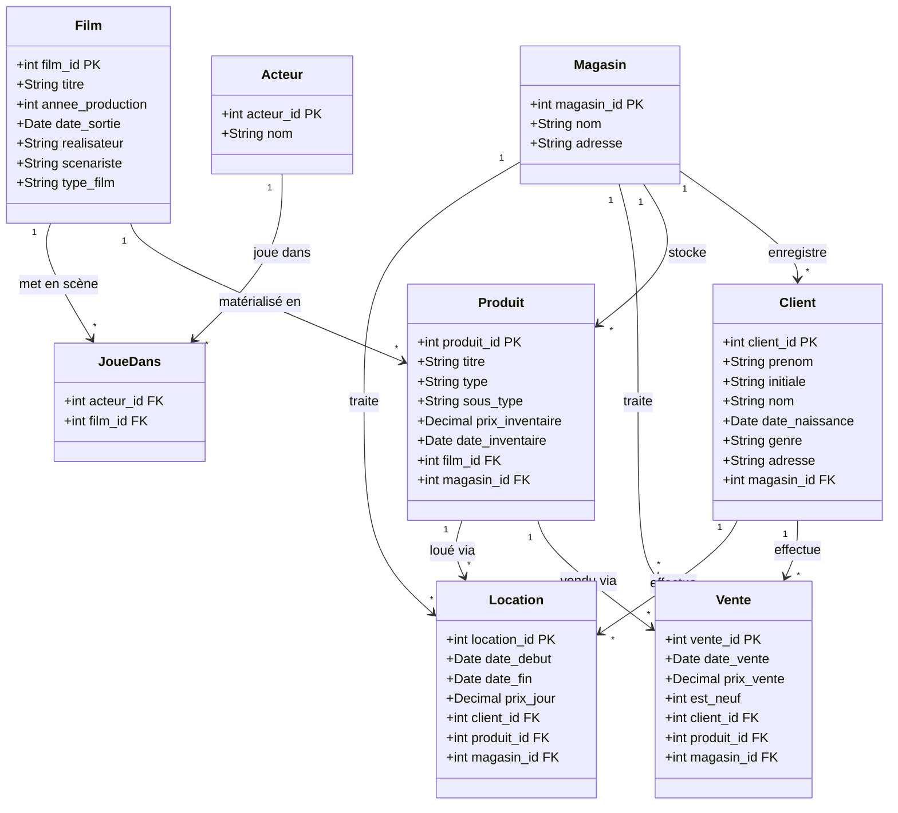
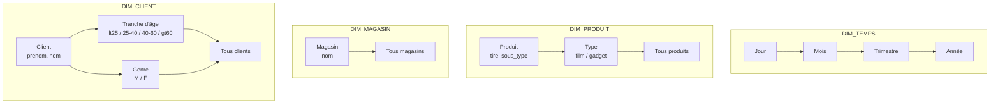
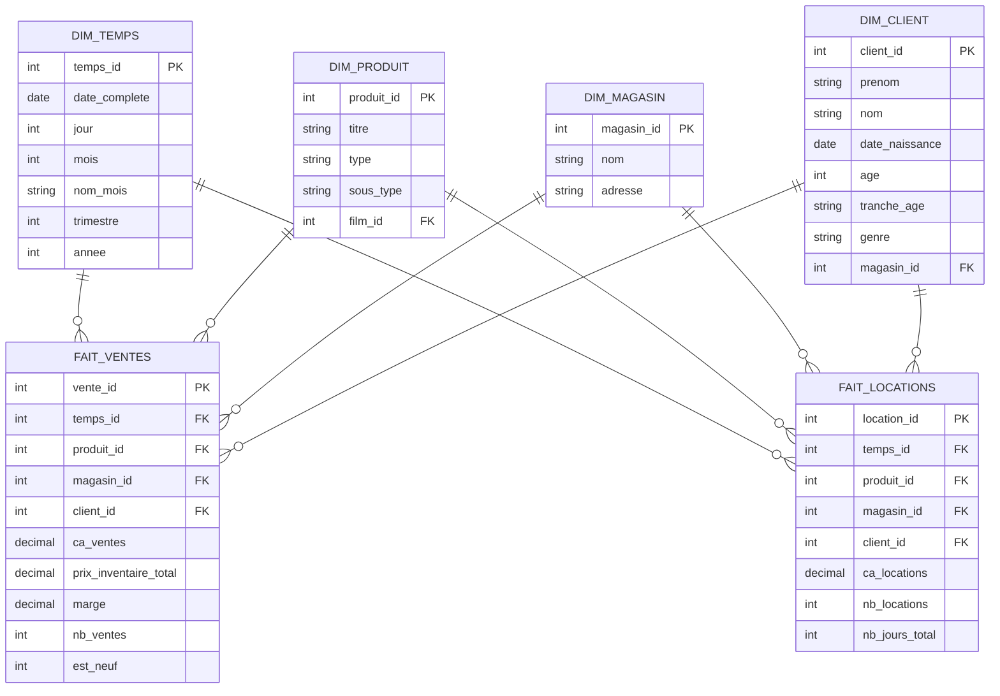
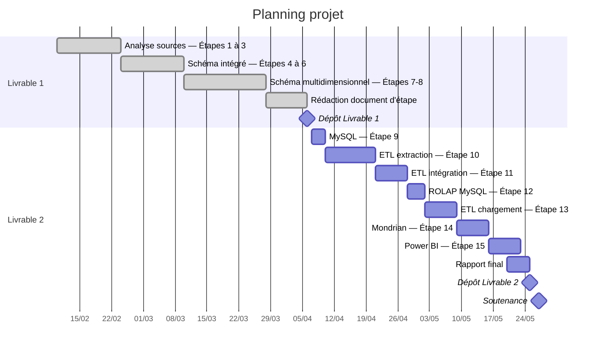

# Entrepôt de données MoreMovies

## Description du projet

La PME MoreMovies a acquis trois magasins de vente et location de films et produits dérivés, chacun disposant de son propre système d'information :

| Magasin       | Abréviation | Base source         |
| ------------- | ----------- | ------------------- |
| BuckBoaster   | BB          | `buckboaster.mdb`   |
| MetroStarlet  | MS          | `metrostarlet.mdb`  |
| MovieMegaMart | MMM         | `moviemegamart.mdb` |

L'objectif est d'intégrer ces trois sources dans un entrepôt de données unique permettant des analyses de ventes et locations par produit, par magasin, par client et par période.

## Étape 1 — Schémas conceptuels par source

### BuckBoaster

Toutes les valeurs textuelles sont préfixées par `T` (artefact d'import). La table `sale_item` mélange stock non vendu (3/4 des lignes, `sale_price` NULL) et ventes effectives. Il n'y a pas de table de location.



Transformations appliquées :
- Normalisation : `sale_item` est divisée en deux concepts — stock (ignoré) et vente effectives (filtre sur `sale_price IS NOT NULL`).
- Enrichissement : le concept `Client` est reconstitué à partir des champs `firstname`, `lastname`, `dob`, `sex` ; une clé de substitution est nécessaire car des doublons existent (1/5 des lignes).
- Abstraction : `sex` n'est pas exploitable (presque tous NULL), ignoré.

### MetroStarlet

Source la plus normalisée. Elle distingue explicitement les copies à la location (`copy_for_rent`) des copies à la vente (`copy_for_sale`) et les transactions de location (`copy_rented_to`). Les clés clients sont des entiers séquentiels non pérennes.



Transformations appliquées :
- Normalisation : `birthday` contient un préfixe `T` sur 100 % des lignes, nettoyage obligatoire.
- Enrichissement : clé de substitution générée pour `Client` (la clé séquentielle 0..N n'est pas pérenne entre chargements).
- Généralisation : `CopieLocation` et `CopieVente` sont des spécialisations d'un concept générique `Copie`, unifié dans le schéma intégré.

### MovieMegaMart

Source la moins normalisée. Les clients ne sont pas stockés dans une table dédiée : leurs informations sont dénormalisées dans chaque transaction. La table `moviecopy` est entièrement vide (0 ligne). Les films n'ont pas de table de référence dans cette source.



Transformations appliquées :
- Reconstruction : l'entité `Client` est reconstruite à partir des champs dénormalisés présents dans chaque table de transaction ; déduplication nécessaire sur `(nom_complet, date_naissance)`.
- Spécialisation : séparation nette entre ventes de films, locations de films et ventes de gadgets.
- Table `moviecopy` ignorée : entièrement vide, aucune donnée utilisable.
- Référence films : les `movie_id` de MMM correspondent aux `movieid` de MetroStarlet — la résolution cross-source est réalisée à l'intégration.

## Étape 2 — Schémas logiques par source et qualité des données

### Mesures de qualité

#### BuckBoaster

| Table       | Champ                     | Valeurs manquantes | %   | Impact                               |
| ----------- | ------------------------- | ------------------ | --- | ------------------------------------ |
| `actor`     | `sex`                     | 118 949 / 119 922  | 99  | Champ ignoré                         |
| `sale_item` | `sale_price`              | 31 455 / 41 706    | 75  | Articles en stock, ignorés           |
| `sale_item` | `sale_date`, `cust_id`    | ~31 455            | 75  | Corrélés à l'absence de `sale_price` |
| `customer`  | doublons (prénom+nom+dob) | 678 / 3 756        | 20  | Clé de substitution + déduplication  |

#### MetroStarlet

| Table            | Champ                    | Valeurs manquantes | %   | Impact                            |
| ---------------- | ------------------------ | ------------------ | --- | --------------------------------- |
| `customer`       | `birthday` (préfixe `T`) | 3 848 / 3 848      | 100 | Nettoyage systématique du préfixe |
| `customer`       | `code` non pérenne       | —                  | —   | Clé de substitution générée       |
| `copy_rented_to` | `copy_id` orphelins      | 0 / 9 826          | 0   | Intégrité référentielle correcte  |

#### MovieMegaMart

| Table        | Champ           | Valeurs manquantes | %   | Impact                    |
| ------------ | --------------- | ------------------ | --- | ------------------------- |
| `moviesales` | `price_sale`    | 1 085 / 10 191     | 10  | Conservé avec valeur NULL |
| `moviecopy`  | toutes colonnes | 10 191 / 10 191    | 100 | Table ignorée             |

### Schémas logiques reconceptualisés

#### BuckBoaster

```sql
CREATE TABLE bb_film (
  film_id    INT AUTO_INCREMENT PRIMARY KEY,
  source_id  VARCHAR(20) NOT NULL UNIQUE,  -- movie_id sans préfixe T
  titre      VARCHAR(300),
  annee      INT
);

CREATE TABLE bb_acteur (
  acteur_id  INT AUTO_INCREMENT PRIMARY KEY,
  source_id  VARCHAR(20) NOT NULL UNIQUE,
  nom        VARCHAR(200)
);

CREATE TABLE bb_joue_dans (
  film_id    INT NOT NULL,
  acteur_id  INT NOT NULL,
  PRIMARY KEY (film_id, acteur_id),
  FOREIGN KEY (film_id)   REFERENCES bb_film(film_id),
  FOREIGN KEY (acteur_id) REFERENCES bb_acteur(acteur_id)
);

CREATE TABLE bb_client (
  client_id      INT AUTO_INCREMENT PRIMARY KEY,
  source_code    VARCHAR(20),
  prenom         VARCHAR(100),
  nom            VARCHAR(100),
  date_naissance DATE,
  genre          CHAR(1)   -- M ou F, après nettoyage TFemale/TMale
);

CREATE TABLE bb_vente_film (
  vente_id        INT AUTO_INCREMENT PRIMARY KEY,
  source_id       INT NOT NULL,
  date_vente      DATE,
  prix_vente      DECIMAL(10,2),
  prix_inventaire DECIMAL(10,2),
  type_produit    VARCHAR(50),
  client_id       INT,
  film_id         INT,
  FOREIGN KEY (client_id) REFERENCES bb_client(client_id),
  FOREIGN KEY (film_id)   REFERENCES bb_film(film_id)
);

CREATE TABLE bb_vente_gadget (
  vente_id        INT AUTO_INCREMENT PRIMARY KEY,
  source_id       INT NOT NULL,
  titre           VARCHAR(200),
  type_gadget     VARCHAR(50),
  date_vente      DATE,
  prix_vente      DECIMAL(10,2),
  prix_inventaire DECIMAL(10,2),
  client_id       INT,
  FOREIGN KEY (client_id) REFERENCES bb_client(client_id)
);
```

#### MetroStarlet

```sql
CREATE TABLE ms_film (
  film_id          INT AUTO_INCREMENT PRIMARY KEY,
  source_id        INT NOT NULL UNIQUE,
  titre            VARCHAR(300),
  annee_production INT,
  date_sortie      DATE,
  prix_sortie      DECIMAL(10,2),
  realisateur      VARCHAR(200),
  scenariste       VARCHAR(200)
);

CREATE TABLE ms_acteur (
  acteur_id  INT AUTO_INCREMENT PRIMARY KEY,
  source_id  INT NOT NULL UNIQUE,
  nom        VARCHAR(200)
);

CREATE TABLE ms_joue_dans (
  film_id    INT NOT NULL,
  acteur_id  INT NOT NULL,
  PRIMARY KEY (film_id, acteur_id),
  FOREIGN KEY (film_id)   REFERENCES ms_film(film_id),
  FOREIGN KEY (acteur_id) REFERENCES ms_acteur(acteur_id)
);

CREATE TABLE ms_client (
  client_id      INT AUTO_INCREMENT PRIMARY KEY,
  source_code    INT,
  prenom         VARCHAR(100),
  initiale       CHAR(5),
  nom            VARCHAR(100),
  genre          CHAR(1),
  date_naissance DATE,     -- préfixe T retiré
  adresse        VARCHAR(300)
);

CREATE TABLE ms_copie_location (
  copie_id   INT AUTO_INCREMENT PRIMARY KEY,
  source_id  INT NOT NULL UNIQUE,
  type_copie VARCHAR(50),
  disposed   TINYINT DEFAULT 0,
  film_id    INT,
  FOREIGN KEY (film_id) REFERENCES ms_film(film_id)
);

CREATE TABLE ms_copie_vente (
  copie_id    INT AUTO_INCREMENT PRIMARY KEY,
  source_id   INT NOT NULL UNIQUE,
  type_copie  VARCHAR(50),
  est_neuf    TINYINT DEFAULT 0,
  prix_vente  DECIMAL(10,2),
  date_vente  DATE,
  film_id     INT,
  client_id   INT,
  FOREIGN KEY (film_id)   REFERENCES ms_film(film_id),
  FOREIGN KEY (client_id) REFERENCES ms_client(client_id)
);

CREATE TABLE ms_location (
  location_id INT AUTO_INCREMENT PRIMARY KEY,
  copie_id    INT,
  client_id   INT,
  date_debut  DATE,
  date_fin    DATE,
  prix_jour   DECIMAL(10,2),
  FOREIGN KEY (copie_id)  REFERENCES ms_copie_location(copie_id),
  FOREIGN KEY (client_id) REFERENCES ms_client(client_id)
);
```

#### MovieMegaMart

```sql
CREATE TABLE mmm_client (
  client_id      INT AUTO_INCREMENT PRIMARY KEY,
  prenom         VARCHAR(100),
  initiale       CHAR(5),
  nom            VARCHAR(100),
  nom_complet    VARCHAR(300),
  genre          CHAR(1),    -- sex_male: 0→F, 1→M
  date_naissance DATE,
  adresse        VARCHAR(300)
);

CREATE TABLE mmm_location_film (
  location_id  INT AUTO_INCREMENT PRIMARY KEY,
  source_id    INT NOT NULL,
  film_ref_id  INT,           -- movie_id, résolu vers ms_film lors de l'intégration
  date_debut   DATE,
  date_fin     DATE,
  prix_jour    DECIMAL(10,2),
  client_id    INT,
  FOREIGN KEY (client_id) REFERENCES mmm_client(client_id)
);

CREATE TABLE mmm_vente_film (
  vente_id    INT AUTO_INCREMENT PRIMARY KEY,
  source_id   INT NOT NULL,
  film_ref_id INT,
  date_vente  DATE,
  prix_vente  DECIMAL(10,2),  -- NULL pour 10,6% des lignes, conservé
  client_id   INT,
  FOREIGN KEY (client_id) REFERENCES mmm_client(client_id)
);

CREATE TABLE mmm_vente_gadget (
  vente_id        INT AUTO_INCREMENT PRIMARY KEY,
  source_id       INT NOT NULL,
  type_gadget     VARCHAR(50),
  titre_gadget    VARCHAR(200),
  date_vente      DATE,
  prix_vente      DECIMAL(10,2),
  prix_inventaire DECIMAL(10,2),
  date_inventaire DATE,
  client_id       INT,
  FOREIGN KEY (client_id) REFERENCES mmm_client(client_id)
);
```

## Étape 3 — Mappings d'extraction (flux source → source reconceptualisée)

### BuckBoaster

#### `bb_film` ← `movie`

| Champ source  | Transformation                  | Champ cible |
| ------------- | ------------------------------- | ----------- |
| `movie_id`    | Supprimer préfixe `T`           | `source_id` |
| `movie_title` | Supprimer préfixe `T`           | `titre`     |
| `movie_year`  | Supprimer préfixe `T`, cast INT | `annee`     |

#### `bb_acteur` ← `actor`

| Champ source | Transformation        | Champ cible |
| ------------ | --------------------- | ----------- |
| `actor_id`   | Supprimer préfixe `T` | `source_id` |
| `actor_name` | Supprimer préfixe `T` | `nom`       |
| `sex`        | Ignoré (99 % NULL)  | —           |

#### `bb_joue_dans` ← `actsin`

| Champ source | Transformation                                  | Champ cible |
| ------------ | ----------------------------------------------- | ----------- |
| `movieid`    | Supprimer `T`, résoudre → `bb_film.film_id`     | `film_id`   |
| `actorid`    | Supprimer `T`, résoudre → `bb_acteur.acteur_id` | `acteur_id` |

#### `bb_client` ← `customer`

| Champ source | Transformation                                                   | Champ cible      |
| ------------ | ---------------------------------------------------------------- | ---------------- |
| `code`       | Supprimer `T`                                                    | `source_code`    |
| `firstname`  | Supprimer `T`                                                    | `prenom`         |
| `lastname`   | Supprimer `T`                                                    | `nom`            |
| `dob`        | Parser date MM/DD/YY                                             | `date_naissance` |
| `sex`        | `TFemale→F`, `TMale→M`                                           | `genre`          |
| (auto)       | Déduplication sur (prenom, nom, date_naissance) + AUTO_INCREMENT | `client_id`      |

#### `bb_vente_film` ← `sale_item` WHERE `sale_price IS NOT NULL`

| Champ source      | Transformation                                  | Champ cible       |
| ----------------- | ----------------------------------------------- | ----------------- |
| `id`              | as-is                                           | `source_id`       |
| `sale_date`       | Parser date                                     | `date_vente`      |
| `sale_price`      | as-is                                           | `prix_vente`      |
| `inventory_price` | as-is                                           | `prix_inventaire` |
| `type`            | Supprimer `T`                                   | `type_produit`    |
| `cust_id`         | Supprimer `T`, résoudre → `bb_client.client_id` | `client_id`       |
| `refers_to`       | Supprimer `T`, résoudre → `bb_film.film_id`     | `film_id`         |

#### `bb_vente_gadget` ← `gadget`

| Champ source | Transformation                                  | Champ cible       |
| ------------ | ----------------------------------------------- | ----------------- |
| `id`         | as-is                                           | `source_id`       |
| `title`      | Supprimer `T`                                   | `titre`           |
| `type`       | Supprimer `T`                                   | `type_gadget`     |
| `sale_date`  | Parser date                                     | `date_vente`      |
| `sale_price` | as-is                                           | `prix_vente`      |
| `price`      | as-is                                           | `prix_inventaire` |
| `cust_id`    | Supprimer `T`, résoudre → `bb_client.client_id` | `client_id`       |

### MetroStarlet

#### `ms_film` ← `movie`

| Champ source      | Transformation | Champ cible        |
| ----------------- | -------------- | ------------------ |
| `movieid`         | as-is          | `source_id`        |
| `movie_title`     | Supprimer `T`  | `titre`            |
| `production_year` | as-is          | `annee_production` |
| `release_date`    | Parser date    | `date_sortie`      |
| `release_price`   | as-is          | `prix_sortie`      |
| `writer`          | Supprimer `T`  | `scenariste`       |
| `director`        | Supprimer `T`  | `realisateur`      |

#### `ms_acteur` ← `actor`

| Champ source | Transformation | Champ cible |
| ------------ | -------------- | ----------- |
| `actor_id`   | as-is          | `source_id` |
| `actor_name` | Supprimer `T`  | `nom`       |

#### `ms_joue_dans` ← `acts_in`

| Champ source | Transformation                   | Champ cible |
| ------------ | -------------------------------- | ----------- |
| `movie_id`   | Résoudre → `ms_film.film_id`     | `film_id`   |
| `actor_id`   | Résoudre → `ms_acteur.acteur_id` | `acteur_id` |

#### `ms_client` ← `customer`

| Champ source | Transformation                                  | Champ cible      |
| ------------ | ----------------------------------------------- | ---------------- |
| `code`       | as-is                                           | `source_code`    |
| `name`       | Supprimer `T`                                   | `prenom`         |
| `middlename` | Supprimer `T`                                   | `initiale`       |
| `surname`    | Supprimer `T`                                   | `nom`            |
| `gender`     | as-is (M/F)                                     | `genre`          |
| `birthday`   | Supprimer préfixe `T`, parser DATE (YYYY-MM-DD) | `date_naissance` |
| `address`    | Supprimer `T`                                   | `adresse`        |

#### `ms_copie_location` ← `copy_for_rent`

| Champ source | Transformation               | Champ cible  |
| ------------ | ---------------------------- | ------------ |
| `id`         | as-is                        | `source_id`  |
| `copy_type`  | Supprimer `T`                | `type_copie` |
| `disposed`   | as-is                        | `disposed`   |
| `movie_id`   | Résoudre → `ms_film.film_id` | `film_id`    |

#### `ms_copie_vente` ← `copy_for_sale`

| Champ source | Transformation                                     | Champ cible  |
| ------------ | -------------------------------------------------- | ------------ |
| `id`         | as-is                                              | `source_id`  |
| `copy_type`  | Supprimer `T`                                      | `type_copie` |
| `is_new`     | as-is                                              | `est_neuf`   |
| `sale_price` | as-is                                              | `prix_vente` |
| `sale_date`  | Parser date                                        | `date_vente` |
| `movie_id`   | Résoudre → `ms_film.film_id`                       | `film_id`    |
| `soldto`     | Résoudre → `ms_client.client_id` via `source_code` | `client_id`  |

#### `ms_location` ← `copy_rented_to`

| Champ source | Transformation                                     | Champ cible  |
| ------------ | -------------------------------------------------- | ------------ |
| `copy_id`    | Résoudre → `ms_copie_location.copie_id`            | `copie_id`   |
| `cust_id`    | Résoudre → `ms_client.client_id` via `source_code` | `client_id`  |
| `from_date`  | Parser date                                        | `date_debut` |
| `to_date`    | Parser date                                        | `date_fin`   |
| `price_day`  | as-is                                              | `prix_jour`  |

### MovieMegaMart

#### `mmm_client` ← `movierentals` + `moviesales` + `gadgetsales` (reconstruit)

| Champ source | Transformation                                                   | Champ cible                                |
| ------------ | ---------------------------------------------------------------- | ------------------------------------------ |
| `cust_name`  | Supprimer `T`, parser "PRÉNOM I. NOM"                            | `prenom`, `initiale`, `nom`, `nom_complet` |
| `sex_male`   | `0→F`, `1→M`                                                     | `genre`                                    |
| `birthdate`  | Parser date                                                      | `date_naissance`                           |
| `address`    | Supprimer `T`                                                    | `adresse`                                  |
| (auto)       | Déduplication sur (nom_complet, date_naissance) + AUTO_INCREMENT | `client_id`                                |

#### `mmm_location_film` ← `movierentals`

| Champ source  | Transformation                                                 | Champ cible   |
| ------------- | -------------------------------------------------------------- | ------------- |
| `ref_no`      | as-is                                                          | `source_id`   |
| `movie_id`    | as-is (résolution cross-source à l'intégration)                | `film_ref_id` |
| `date_from`   | Parser date                                                    | `date_debut`  |
| `date_to`     | Parser date                                                    | `date_fin`    |
| `price_rent`  | as-is                                                          | `prix_jour`   |
| (reconstruit) | Résoudre → `mmm_client.client_id` via (nom_complet, birthdate) | `client_id`   |

#### `mmm_vente_film` ← `moviesales`

| Champ source  | Transformation                               | Champ cible   |
| ------------- | -------------------------------------------- | ------------- |
| `ref_no`      | as-is                                        | `source_id`   |
| `movie_id`    | as-is                                        | `film_ref_id` |
| `sale_date`   | Parser date                                  | `date_vente`  |
| `price_sale`  | as-is (NULL conservé pour 10,6 % des lignes) | `prix_vente`  |
| (reconstruit) | Résoudre → `mmm_client.client_id`            | `client_id`   |

#### `mmm_vente_gadget` ← `gadgetsales`

| Champ source   | Transformation                    | Champ cible       |
| -------------- | --------------------------------- | ----------------- |
| `ref_no`       | as-is                             | `source_id`       |
| `gadget_type`  | Supprimer `T`                     | `type_gadget`     |
| `gadget_title` | Supprimer `T`                     | `titre_gadget`    |
| `sale_date`    | Parser date                       | `date_vente`      |
| `price_sale`   | as-is                             | `prix_vente`      |
| `inv_price`    | as-is                             | `prix_inventaire` |
| `inv_date`     | Parser date                       | `date_inventaire` |
| (reconstruit)  | Résoudre → `mmm_client.client_id` | `client_id`       |

## Étape 4 — Schéma conceptuel intégré

### Correspondances inter-schémas

| Concept BB    | Concept MS   | Concept MMM                  | Concept intégré       |
| ------------- | ------------ | ---------------------------- | --------------------- |
| `Film`        | `Film`       | (référence implicite via ID) | `Film`                |
| `Acteur`      | `Acteur`     | (absent)                     | `Acteur`              |
| `Client`      | `Client`     | `Client` (reconstruit)       | `Client`              |
| `VenteFilm`   | `CopieVente` | `VenteFilm`                  | `Vente`               |
| `VenteGadget` | (absent)     | `VenteGadget`                | `Vente` (type gadget) |
| (absent)      | `Location`   | `LocationFilm`               | `Location`            |
| (absent)      | (absent)     | (absent)                     | `Magasin` (ajouté)    |

> Le concept `Magasin` est ajouté par enrichissement : absent de toutes les sources (chacune représente un seul magasin), il est indispensable à l'analyse multi-magasins.



## Étape 5 — Schéma logique intégré

```sql
CREATE TABLE magasin (
  magasin_id  INT          NOT NULL AUTO_INCREMENT,
  nom         VARCHAR(100) NOT NULL,
  adresse     VARCHAR(300),
  PRIMARY KEY (magasin_id)
);

CREATE TABLE client (
  client_id       INT          NOT NULL AUTO_INCREMENT,
  prenom          VARCHAR(100),
  initiale        CHAR(5),
  nom             VARCHAR(100),
  date_naissance  DATE,
  genre           CHAR(1),
  adresse         VARCHAR(300),
  magasin_id      INT          NOT NULL,
  source          CHAR(3),                    -- 'BB', 'MS', 'MMM'
  source_code     VARCHAR(30),
  PRIMARY KEY (client_id),
  FOREIGN KEY (magasin_id) REFERENCES magasin(magasin_id)
);

CREATE TABLE film (
  film_id          INT          NOT NULL AUTO_INCREMENT,
  titre            VARCHAR(300),
  annee_production INT,
  date_sortie      DATE,
  prix_sortie      DECIMAL(10,2),
  realisateur      VARCHAR(200),
  scenariste       VARCHAR(200),
  type_film        VARCHAR(50),
  PRIMARY KEY (film_id)
);

CREATE TABLE acteur (
  acteur_id   INT          NOT NULL AUTO_INCREMENT,
  nom         VARCHAR(200),
  PRIMARY KEY (acteur_id)
);

CREATE TABLE joue_dans (
  film_id     INT NOT NULL,
  acteur_id   INT NOT NULL,
  PRIMARY KEY (film_id, acteur_id),
  FOREIGN KEY (film_id)   REFERENCES film(film_id),
  FOREIGN KEY (acteur_id) REFERENCES acteur(acteur_id)
);

CREATE TABLE produit (
  produit_id      INT          NOT NULL AUTO_INCREMENT,
  titre           VARCHAR(300),
  type            VARCHAR(20)  NOT NULL,    -- 'film', 'gadget'
  sous_type       VARCHAR(50),              -- 'movie', 'tv movie', 'Clock', 'Hat'…
  prix_inventaire DECIMAL(10,2),
  date_inventaire DATE,
  film_id         INT,
  magasin_id      INT,
  PRIMARY KEY (produit_id),
  FOREIGN KEY (film_id)    REFERENCES film(film_id),
  FOREIGN KEY (magasin_id) REFERENCES magasin(magasin_id)
);

CREATE TABLE vente (
  vente_id    INT          NOT NULL AUTO_INCREMENT,
  date_vente  DATE,
  prix_vente  DECIMAL(10,2),
  est_neuf    TINYINT      DEFAULT 0,
  client_id   INT,
  produit_id  INT,
  magasin_id  INT          NOT NULL,
  source      CHAR(3),
  PRIMARY KEY (vente_id),
  FOREIGN KEY (client_id)  REFERENCES client(client_id),
  FOREIGN KEY (produit_id) REFERENCES produit(produit_id),
  FOREIGN KEY (magasin_id) REFERENCES magasin(magasin_id)
);

CREATE TABLE location (
  location_id   INT          NOT NULL AUTO_INCREMENT,
  date_debut    DATE,
  date_fin      DATE,
  prix_jour     DECIMAL(10,2),
  client_id     INT,
  produit_id    INT,
  magasin_id    INT          NOT NULL,
  source        CHAR(3),
  PRIMARY KEY (location_id),
  FOREIGN KEY (client_id)  REFERENCES client(client_id),
  FOREIGN KEY (produit_id) REFERENCES produit(produit_id),
  FOREIGN KEY (magasin_id) REFERENCES magasin(magasin_id)
);
```

## Étape 6 — Mappings d'intégration (flux sources reconceptualisées → schéma intégré)

### `magasin`

| Valeur injectée | `magasin_id` | `nom`         |
| --------------- | ------------ | ------------- |
| Constante       | 1            | BuckBoaster   |
| Constante       | 2            | MetroStarlet  |
| Constante       | 3            | MovieMegaMart |

### `film`

| Source | Table source        | Champ source                                                                           | Champ cible                                 |
| ------ | ------------------- | -------------------------------------------------------------------------------------- | ------------------------------------------- |
| BB     | `bb_film`           | `titre`, `annee`                                                                       | `titre`, `annee_production`                 |
| MS     | `ms_film`           | `titre`, `annee_production`, `date_sortie`, `prix_sortie`, `realisateur`, `scenariste` | idem                                        |
| MMM    | (pas de table film) | `film_ref_id` → `ms_film.source_id`                                                    | résolution cross-source vers `film.film_id` |

> Fusion BB ↔ MS : appariement par normalisation du titre (minuscules, ponctuation retirée). En cas de correspondance, la fiche MS est prioritaire (plus complète). Les films BB sans correspondance sont insérés avec les seuls champs disponibles.

### `acteur` et `joue_dans`

| Source | Table source                    | Champ source           | Champ cible                               |
| ------ | ------------------------------- | ---------------------- | ----------------------------------------- |
| BB     | `bb_acteur`                     | `nom`                  | `nom`                                     |
| MS     | `ms_acteur`                     | `nom`                  | `nom`                                     |
| BB/MS  | `bb_joue_dans` / `ms_joue_dans` | `film_id`, `acteur_id` | `film_id`, `acteur_id` (après résolution) |

> Fusion des acteurs inter-sources par normalisation du nom.

### `client`

| Source | Table source | Champs source                                                     | `magasin_id` | `source` |
| ------ | ------------ | ----------------------------------------------------------------- | ------------ | -------- |
| BB     | `bb_client`  | `prenom`, `nom`, `date_naissance`, `genre`                        | 1            | 'BB'     |
| MS     | `ms_client`  | `prenom`, `initiale`, `nom`, `genre`, `date_naissance`, `adresse` | 2            | 'MS'     |
| MMM    | `mmm_client` | `prenom`, `initiale`, `nom`, `genre`, `date_naissance`, `adresse` | 3            | 'MMM'    |

> Les clients ne sont pas fusionnés inter-sources : un même individu peut être client dans plusieurs magasins.

### `produit`

| Source | Table source        | `type`     | Champs source                                                                 | Champ cible                               |
| ------ | ------------------- | ---------- | ----------------------------------------------------------------------------- | ----------------------------------------- |
| BB     | `bb_vente_film`     | `'film'`   | `type_produit → sous_type`, `prix_inventaire`, `film_id`                        | `sous_type`, `prix_inventaire`, `film_id` |
| BB     | `bb_vente_gadget`   | `'gadget'` | `type_gadget → sous_type`, `titre`, `prix_inventaire`                           | idem                                      |
| MS     | `ms_copie_location` | `'film'`   | `type_copie → sous_type`, `film_id`                                             | idem                                      |
| MS     | `ms_copie_vente`    | `'film'`   | `type_copie → sous_type`, `film_id`                                             | idem                                      |
| MMM    | `mmm_vente_gadget`  | `'gadget'` | `type_gadget → sous_type`, `titre_gadget`, `prix_inventaire`, `date_inventaire` | idem                                      |
| MMM    | `mmm_location_film` | `'film'`   | `film_ref_id → film.film_id`                                                    | `film_id`                                 |

### `vente`

| Source | Table source       | Champs source                                                     | Champ cible |
| ------ | ------------------ | ----------------------------------------------------------------- | ----------- |
| BB     | `bb_vente_film`    | `date_vente`, `prix_vente`, `client_id`, `produit_id`             | idem        |
| BB     | `bb_vente_gadget`  | `date_vente`, `prix_vente`, `client_id`, `produit_id`             | idem        |
| MS     | `ms_copie_vente`   | `date_vente`, `prix_vente`, `est_neuf`, `client_id`, `produit_id` | idem        |
| MMM    | `mmm_vente_film`   | `date_vente`, `prix_vente`, `client_id`, `produit_id`             | idem        |
| MMM    | `mmm_vente_gadget` | `date_vente`, `prix_vente`, `client_id`, `produit_id`             | idem        |

### `location`

| Source | Table source        | Champs source                                                    | Champ cible |
| ------ | ------------------- | ---------------------------------------------------------------- | ----------- |
| MS     | `ms_location`       | `date_debut`, `date_fin`, `prix_jour`, `client_id`, `produit_id` | idem        |
| MMM    | `mmm_location_film` | `date_debut`, `date_fin`, `prix_jour`, `client_id`, `produit_id` | idem        |

> BuckBoaster ne contribue pas à `location` : aucune donnée de location n'est présente dans cette source.

## Étape 7 — Schéma multidimensionnel conceptuel

Le schéma est construit par approche supply-driven à partir du schéma intégré.

### Dimensions et hiérarchies



### Cubes et mesures

#### Cube VENTES

| Mesure                  | Classe   | Formule                             | Additivité          |
| ----------------------- | -------- | ----------------------------------- | ------------------- |
| `ca_ventes`             | Base     | `SUM(prix_vente)`                   | Pleinement additive |
| `nb_ventes`             | Base     | `COUNT(*)`                          | Pleinement additive |
| `prix_inventaire_total` | Base     | `SUM(prix_inventaire)`              | Pleinement additive |
| `marge`                 | Calculée | `ca_ventes − prix_inventaire_total` | Pleinement additive |
| `ca_moyen_vente`        | Dérivée  | `ca_ventes / nb_ventes`             | Non additive        |
| `nb_clients_acheteurs`  | Dérivée  | `COUNT(DISTINCT client_id)`         | Semi-additive       |
| `nb_moyen_ventes`       | Dérivée  | `nb_ventes / nb_clients_acheteurs`  | Non additive        |

#### Cube LOCATIONS

| Mesure                   | Classe   | Formule                                | Additivité          |
| ------------------------ | -------- | -------------------------------------- | ------------------- |
| `ca_locations`           | Calculée | `SUM(prix_jour × nb_jours)`            | Pleinement additive |
| `nb_locations`           | Base     | `COUNT(*)`                             | Pleinement additive |
| `nb_jours_total`         | Base     | `SUM(DATEDIFF(date_fin, date_debut))`  | Pleinement additive |
| `ca_moyen_location`      | Dérivée  | `ca_locations / nb_locations`          | Non additive        |
| `nb_clients_locataires`  | Dérivée  | `COUNT(DISTINCT client_id)`            | Semi-additive       |
| `nb_moyen_locations`     | Dérivée  | `nb_locations / nb_clients_locataires` | Non additive        |
| `duree_moyenne_location` | Dérivée  | `nb_jours_total / nb_locations`        | Non additive        |

### Schéma en constellation



Justification des clés de tables de faits : la combinaison (temps_id, produit_id, magasin_id, client_id) n'est pas unique — un client peut acheter ou louer le même produit plusieurs fois le même jour. Une clé de substitution (`vente_id`, `location_id`) est donc nécessaire.

## Étape 8 — Schéma logique ROLAP et modèle physique

### Choix étoile vs flocon

Schéma en constellation (deux tables de faits) avec des dimensions en étoile : les tables de dimension ne sont pas normalisées davantage. Ce choix réduit le nombre de jointures et est nativement supporté par Mondrian.

### DDL MySQL

```sql
CREATE TABLE dim_temps (
  temps_id      INT  NOT NULL AUTO_INCREMENT,
  date_complete DATE NOT NULL,
  jour          INT  NOT NULL,
  mois          INT  NOT NULL,
  nom_mois      VARCHAR(20),
  trimestre     INT  NOT NULL,
  annee         INT  NOT NULL,
  PRIMARY KEY (temps_id),
  UNIQUE KEY uq_date (date_complete),
  INDEX idx_annee           (annee),
  INDEX idx_annee_mois      (annee, mois),
  INDEX idx_annee_mois_jour (annee, mois, jour)
);

CREATE TABLE dim_magasin (
  magasin_id INT          NOT NULL AUTO_INCREMENT,
  nom        VARCHAR(100) NOT NULL,
  adresse    VARCHAR(300),
  PRIMARY KEY (magasin_id)
);

CREATE TABLE dim_client (
  client_id      INT  NOT NULL AUTO_INCREMENT,
  prenom         VARCHAR(100),
  nom            VARCHAR(100),
  date_naissance DATE,
  age            INT,
  tranche_age    VARCHAR(20),   -- '<25', '25-40', '40-60', '>60'
  genre          CHAR(1),
  magasin_id     INT,
  PRIMARY KEY (client_id),
  INDEX idx_genre       (genre),
  INDEX idx_tranche_age (tranche_age),
  FOREIGN KEY (magasin_id) REFERENCES dim_magasin(magasin_id)
);

CREATE TABLE dim_produit (
  produit_id INT          NOT NULL AUTO_INCREMENT,
  titre      VARCHAR(300),
  type       VARCHAR(20)  NOT NULL,   -- 'film', 'gadget'
  sous_type  VARCHAR(50),
  film_id    INT,
  PRIMARY KEY (produit_id),
  INDEX idx_type (type)
);

CREATE TABLE fait_ventes (
  vente_id              INT            NOT NULL AUTO_INCREMENT,
  temps_id              INT            NOT NULL,
  magasin_id            INT            NOT NULL,
  client_id             INT            NOT NULL,
  produit_id            INT            NOT NULL,
  ca_ventes             DECIMAL(12,2),
  prix_inventaire_total DECIMAL(12,2),
  marge                 DECIMAL(12,2),
  nb_ventes             INT            NOT NULL DEFAULT 1,
  est_neuf              TINYINT        DEFAULT 0,
  PRIMARY KEY (vente_id),
  INDEX idx_temps    (temps_id),
  INDEX idx_magasin  (magasin_id),
  INDEX idx_client   (client_id),
  INDEX idx_produit  (produit_id),
  FOREIGN KEY (temps_id)   REFERENCES dim_temps(temps_id),
  FOREIGN KEY (magasin_id) REFERENCES dim_magasin(magasin_id),
  FOREIGN KEY (client_id)  REFERENCES dim_client(client_id),
  FOREIGN KEY (produit_id) REFERENCES dim_produit(produit_id)
)
PARTITION BY RANGE (annee_from_temps_id) (
  -- NB : en pratique, partitionner via une colonne redondante annee INT
  -- ou utiliser une vue avec la jointure dim_temps pour le pruning
  PARTITION p2005 VALUES LESS THAN (2006),
  PARTITION p2006 VALUES LESS THAN (2007),
  PARTITION p2007 VALUES LESS THAN (2008),
  PARTITION p2008 VALUES LESS THAN (2009),
  PARTITION p2009 VALUES LESS THAN (2010),
  PARTITION p2010 VALUES LESS THAN (2011),
  PARTITION pmax  VALUES LESS THAN MAXVALUE
);

CREATE TABLE fait_locations (
  location_id    INT            NOT NULL AUTO_INCREMENT,
  temps_id       INT            NOT NULL,
  magasin_id     INT            NOT NULL,
  client_id      INT            NOT NULL,
  produit_id     INT            NOT NULL,
  ca_locations   DECIMAL(12,2),
  nb_locations   INT            NOT NULL DEFAULT 1,
  nb_jours_total INT,
  PRIMARY KEY (location_id),
  INDEX idx_temps    (temps_id),
  INDEX idx_magasin  (magasin_id),
  INDEX idx_client   (client_id),
  INDEX idx_produit  (produit_id),
  FOREIGN KEY (temps_id)   REFERENCES dim_temps(temps_id),
  FOREIGN KEY (magasin_id) REFERENCES dim_magasin(magasin_id),
  FOREIGN KEY (client_id)  REFERENCES dim_client(client_id),
  FOREIGN KEY (produit_id) REFERENCES dim_produit(produit_id)
)
PARTITION BY RANGE (annee_from_temps_id) (
  PARTITION p2005 VALUES LESS THAN (2006),
  PARTITION p2006 VALUES LESS THAN (2007),
  PARTITION p2007 VALUES LESS THAN (2008),
  PARTITION p2008 VALUES LESS THAN (2009),
  PARTITION p2009 VALUES LESS THAN (2010),
  PARTITION p2010 VALUES LESS THAN (2011),
  PARTITION pmax  VALUES LESS THAN MAXVALUE
);
```

### Tables d'agrégats

Les vues matérialisées d'Oracle n'étant pas disponibles sous MySQL, les agrégats sont implémentés sous forme de tables alimentées par les flux ETL et référencées dans le schéma Mondrian.

```sql
-- Agrégat 1 : CA mensuel par magasin
-- Répond aux analyses "par magasin, par mois/an"
CREATE TABLE agg_ventes_mois_magasin (
  annee        INT            NOT NULL,
  mois         INT            NOT NULL,
  magasin_id   INT            NOT NULL,
  ca_total     DECIMAL(14,2),
  marge_totale DECIMAL(14,2),
  nb_ventes    INT,
  nb_clients   INT,
  PRIMARY KEY (annee, mois, magasin_id),
  FOREIGN KEY (magasin_id) REFERENCES dim_magasin(magasin_id)
);

-- Agrégat 2 : CA mensuel par produit
-- Répond aux "top 5 films par CA mensuel/annuel"
CREATE TABLE agg_ventes_mois_produit (
  annee        INT            NOT NULL,
  mois         INT            NOT NULL,
  produit_id   INT            NOT NULL,
  type_produit VARCHAR(20),
  ca_total     DECIMAL(14,2),
  nb_ventes    INT,
  PRIMARY KEY (annee, mois, produit_id),
  FOREIGN KEY (produit_id) REFERENCES dim_produit(produit_id)
);

-- Agrégat 3 : locations mensuelles par produit et magasin
-- Répond aux "films les plus loués par magasin et par mois"
CREATE TABLE agg_locations_mois_produit_magasin (
  annee          INT            NOT NULL,
  mois           INT            NOT NULL,
  produit_id     INT            NOT NULL,
  magasin_id     INT            NOT NULL,
  ca_total       DECIMAL(14,2),
  nb_locations   INT,
  nb_jours_total INT,
  PRIMARY KEY (annee, mois, produit_id, magasin_id),
  FOREIGN KEY (produit_id) REFERENCES dim_produit(produit_id),
  FOREIGN KEY (magasin_id) REFERENCES dim_magasin(magasin_id)
);
```

### Justification des choix physiques

Index : créés sur toutes les clés étrangères des tables de faits pour accélérer les jointures étoile, et sur les attributs fréquemment filtrés dans les dimensions (`genre`, `tranche_age`, `type`, `annee`).

Partitions : les tables de faits sont partitionnées par année. MySQL élimine les partitions non pertinentes lors des requêtes temporelles. Les données couvrent 2005–2010 d'après l'analyse des sources.

Tables d'agrégats : remplacent les vues matérialisées (non disponibles en MySQL). Elles stockent des précalculs exploités par Mondrian via son mécanisme de réécriture de requêtes, évitant les `GROUP BY` coûteux sur les tables de faits complètes.

## Diagramme de GANTT prévisionnel

