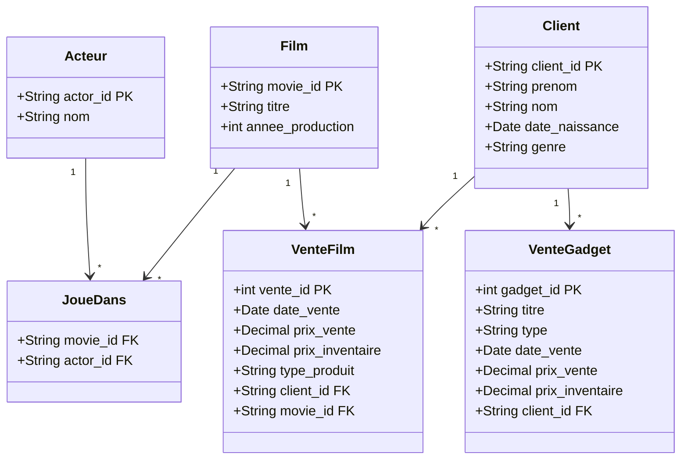
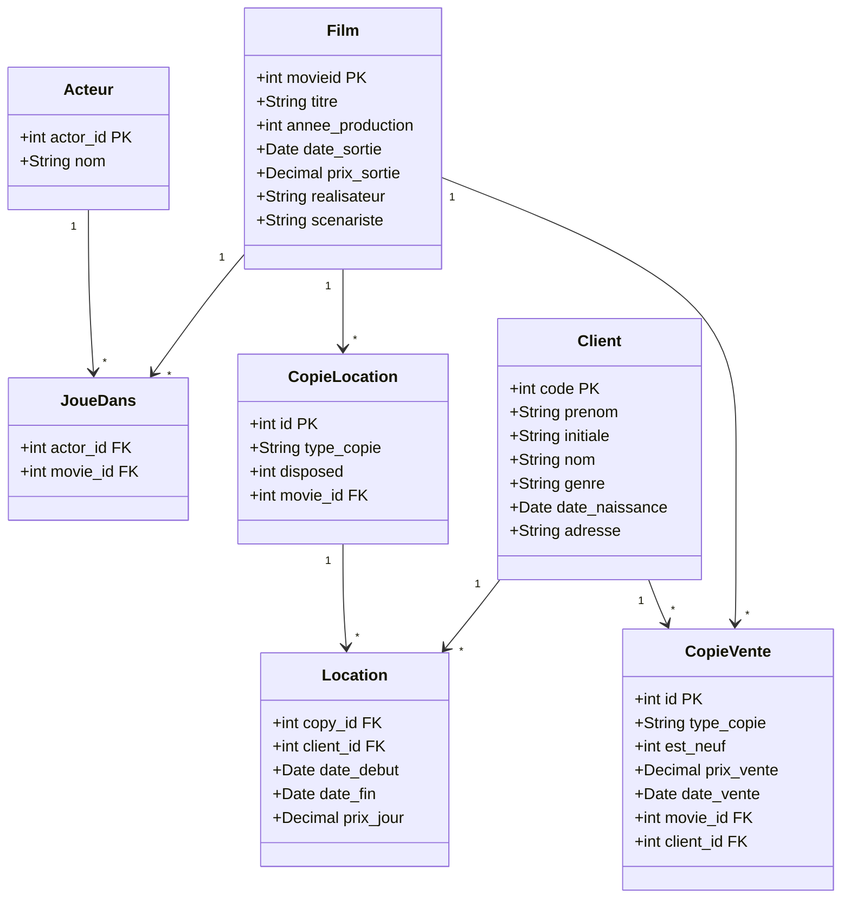
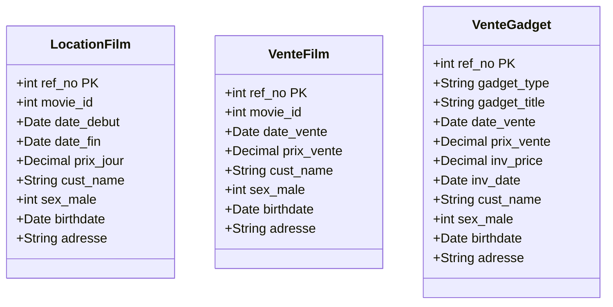
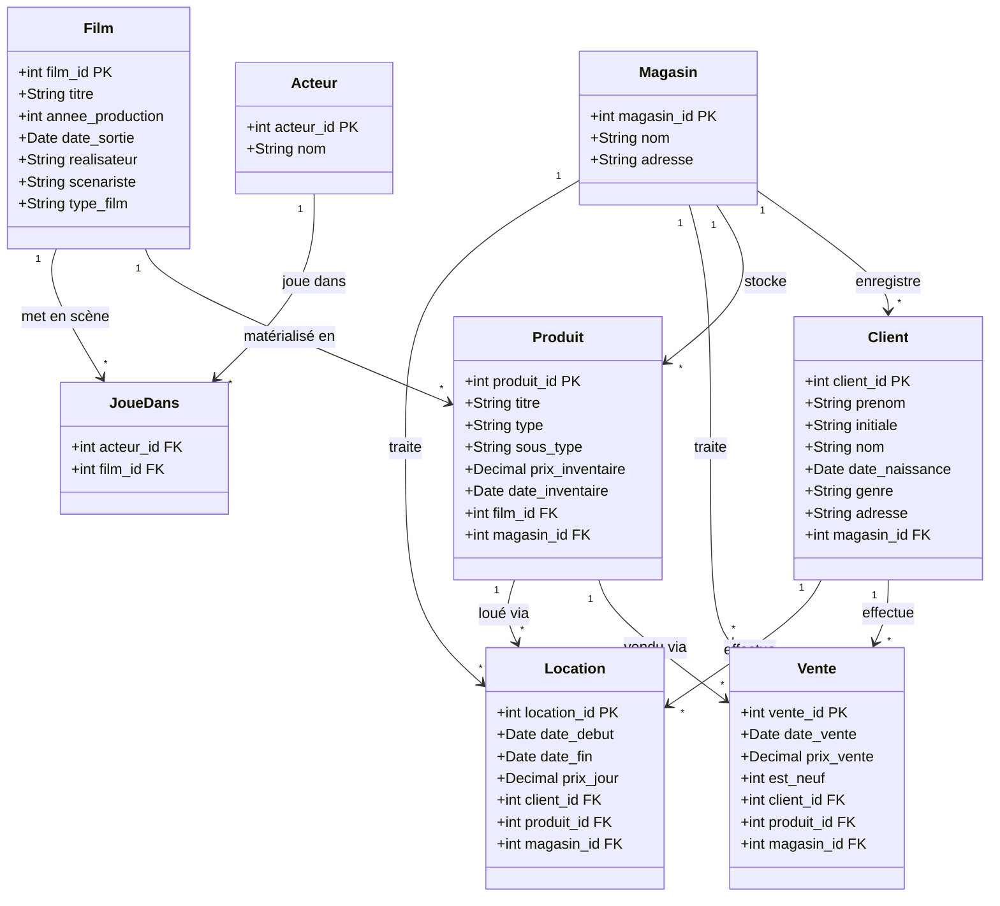
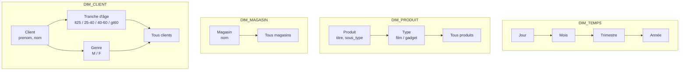
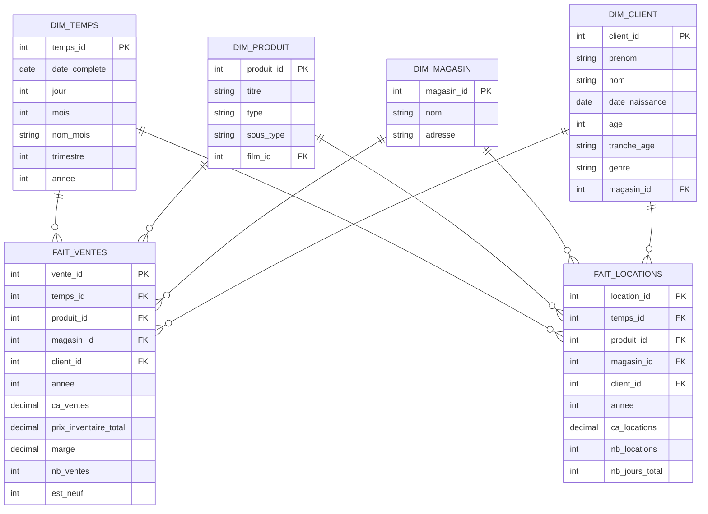
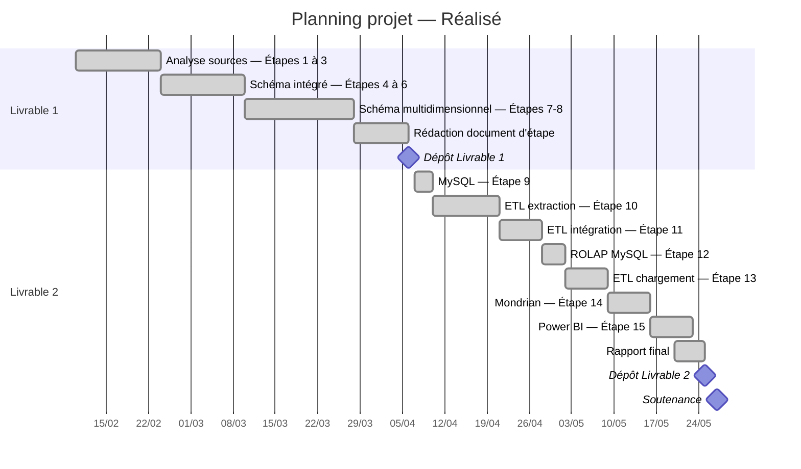

# Entrepôt de données MoreMovies — Rapport final

## Description du projet

La PME MoreMovies a acquis trois magasins de vente et location de films et produits dérivés, chacun disposant de son propre système d'information :

| Magasin       | Abréviation | Base source         |
| ------------- | ----------- | ------------------- |
| BuckBoaster   | BB          | `buckboaster.mdb`   |
| MetroStarlet  | MS          | `metrostarlet.mdb`  |
| MovieMegaMart | MMM         | `moviemegamart.mdb` |

L'objectif est d'intégrer ces trois sources dans un entrepôt de données unique permettant des analyses de ventes et locations par produit, par magasin, par client et par période.

## Étape 1 — Schémas conceptuels par source

### BuckBoaster

Toutes les valeurs textuelles sont préfixées par `T` (artefact d'import). La table `sale_item` mélange stock non vendu (3/4 des lignes, `sale_price` NULL) et ventes effectives. Il n'y a pas de table de location.



Transformations appliquées :
- Normalisation : `sale_item` est divisée en deux concepts — stock (ignoré) et ventes effectives (filtre sur `sale_price IS NOT NULL`).
- Enrichissement : le concept `Client` est reconstitué à partir des champs `firstname`, `lastname`, `dob`, `sex` ; une clé de substitution est nécessaire car des doublons existent (1/5 des lignes).
- Abstraction : `sex` n'est pas exploitable (presque tous NULL), ignoré.

### MetroStarlet

Source la plus normalisée. Elle distingue explicitement les copies à la location (`copy_for_rent`) des copies à la vente (`copy_for_sale`) et les transactions de location (`copy_rented_to`). Les clés clients sont des entiers séquentiels non pérennes.



Transformations appliquées :
- Normalisation : `birthday` contient un préfixe `T` sur 100 % des lignes, nettoyage obligatoire.
- Enrichissement : clé de substitution générée pour `Client` (la clé séquentielle 0..N n'est pas pérenne entre chargements).
- Généralisation : `CopieLocation` et `CopieVente` sont des spécialisations d'un concept générique `Copie`, unifié dans le schéma intégré.

### MovieMegaMart

Source la moins normalisée. Les clients ne sont pas stockés dans une table dédiée : leurs informations sont dénormalisées dans chaque transaction. La table `moviecopy` est entièrement vide (0 ligne). Les films n'ont pas de table de référence dans cette source.



Transformations appliquées :
- Reconstruction : l'entité `Client` est reconstruite à partir des champs dénormalisés présents dans chaque table de transaction ; déduplication nécessaire sur `(nom_complet, date_naissance)`.
- Spécialisation : séparation nette entre ventes de films, locations de films et ventes de gadgets.
- Table `moviecopy` ignorée : entièrement vide, aucune donnée utilisable.
- Référence films : les `movie_id` de MMM correspondent aux `movieid` de MetroStarlet — la résolution cross-source est réalisée à l'intégration.

## Étape 2 — Schémas logiques par source et qualité des données

### Mesures de qualité

#### BuckBoaster

| Table       | Champ                     | Valeurs manquantes | %   | Impact                               |
| ----------- | ------------------------- | ------------------ | --- | ------------------------------------ |
| `actor`     | `sex`                     | 118 949 / 119 922  | 99  | Champ ignoré                         |
| `sale_item` | `sale_price`              | 31 455 / 41 706    | 75  | Articles en stock, ignorés           |
| `sale_item` | `sale_date`, `cust_id`    | ~31 455            | 75  | Corrélés à l'absence de `sale_price` |
| `customer`  | doublons (prénom+nom+dob) | 678 / 3 756        | 20  | Clé de substitution + déduplication  |

#### MetroStarlet

| Table            | Champ                    | Valeurs manquantes | %   | Impact                            |
| ---------------- | ------------------------ | ------------------ | --- | --------------------------------- |
| `customer`       | `birthday` (préfixe `T`) | 3 848 / 3 848      | 100 | Nettoyage systématique du préfixe |
| `customer`       | `code` non pérenne       | —                  | —   | Clé de substitution générée       |
| `copy_rented_to` | `copy_id` orphelins      | 0 / 9 826          | 0   | Intégrité référentielle correcte  |

#### MovieMegaMart

| Table        | Champ           | Valeurs manquantes | %   | Impact                    |
| ------------ | --------------- | ------------------ | --- | ------------------------- |
| `moviesales` | `price_sale`    | 1 085 / 10 191     | 10  | Conservé avec valeur NULL |
| `moviecopy`  | toutes colonnes | 10 191 / 10 191    | 100 | Table ignorée             |

### Schémas logiques reconceptualisés

#### BuckBoaster

```sql
CREATE TABLE bb_film (
  film_id    INT AUTO_INCREMENT PRIMARY KEY,
  source_id  VARCHAR(20) NOT NULL UNIQUE,
  titre      VARCHAR(300),
  annee      INT
);

CREATE TABLE bb_acteur (
  acteur_id  INT AUTO_INCREMENT PRIMARY KEY,
  source_id  VARCHAR(20) NOT NULL UNIQUE,
  nom        VARCHAR(200)
);

CREATE TABLE bb_joue_dans (
  film_id    INT NOT NULL,
  acteur_id  INT NOT NULL,
  PRIMARY KEY (film_id, acteur_id),
  FOREIGN KEY (film_id)   REFERENCES bb_film(film_id),
  FOREIGN KEY (acteur_id) REFERENCES bb_acteur(acteur_id)
);

CREATE TABLE bb_client (
  client_id      INT AUTO_INCREMENT PRIMARY KEY,
  source_code    VARCHAR(20),
  prenom         VARCHAR(100),
  nom            VARCHAR(100),
  date_naissance DATE,
  genre          CHAR(1)
);

CREATE TABLE bb_vente_film (
  vente_id        INT AUTO_INCREMENT PRIMARY KEY,
  source_id       INT NOT NULL,
  date_vente      DATE,
  prix_vente      DECIMAL(10,2),
  prix_inventaire DECIMAL(10,2),
  type_produit    VARCHAR(50),
  client_id       INT,
  film_id         INT,
  FOREIGN KEY (client_id) REFERENCES bb_client(client_id),
  FOREIGN KEY (film_id)   REFERENCES bb_film(film_id)
);

CREATE TABLE bb_vente_gadget (
  vente_id        INT AUTO_INCREMENT PRIMARY KEY,
  source_id       INT NOT NULL,
  titre           VARCHAR(200),
  type_gadget     VARCHAR(50),
  date_vente      DATE,
  prix_vente      DECIMAL(10,2),
  prix_inventaire DECIMAL(10,2),
  client_id       INT,
  FOREIGN KEY (client_id) REFERENCES bb_client(client_id)
);
```

#### MetroStarlet

```sql
CREATE TABLE ms_film (
  film_id          INT AUTO_INCREMENT PRIMARY KEY,
  source_id        INT NOT NULL UNIQUE,
  titre            VARCHAR(300),
  annee_production INT,
  date_sortie      DATE,
  prix_sortie      DECIMAL(10,2),
  realisateur      VARCHAR(200),
  scenariste       VARCHAR(200)
);

CREATE TABLE ms_acteur (
  acteur_id  INT AUTO_INCREMENT PRIMARY KEY,
  source_id  INT NOT NULL UNIQUE,
  nom        VARCHAR(200)
);

CREATE TABLE ms_joue_dans (
  film_id    INT NOT NULL,
  acteur_id  INT NOT NULL,
  PRIMARY KEY (film_id, acteur_id),
  FOREIGN KEY (film_id)   REFERENCES ms_film(film_id),
  FOREIGN KEY (acteur_id) REFERENCES ms_acteur(acteur_id)
);

CREATE TABLE ms_client (
  client_id      INT AUTO_INCREMENT PRIMARY KEY,
  source_code    INT,
  prenom         VARCHAR(100),
  initiale       CHAR(5),
  nom            VARCHAR(100),
  genre          CHAR(1),
  date_naissance DATE,
  adresse        VARCHAR(300)
);

CREATE TABLE ms_copie_location (
  copie_id   INT AUTO_INCREMENT PRIMARY KEY,
  source_id  INT NOT NULL UNIQUE,
  type_copie VARCHAR(50),
  disposed   TINYINT DEFAULT 0,
  film_id    INT,
  FOREIGN KEY (film_id) REFERENCES ms_film(film_id)
);

CREATE TABLE ms_copie_vente (
  copie_id    INT AUTO_INCREMENT PRIMARY KEY,
  source_id   INT NOT NULL UNIQUE,
  type_copie  VARCHAR(50),
  est_neuf    TINYINT DEFAULT 0,
  prix_vente  DECIMAL(10,2),
  date_vente  DATE,
  film_id     INT,
  client_id   INT,
  FOREIGN KEY (film_id)   REFERENCES ms_film(film_id),
  FOREIGN KEY (client_id) REFERENCES ms_client(client_id)
);

CREATE TABLE ms_location (
  location_id INT AUTO_INCREMENT PRIMARY KEY,
  copie_id    INT,
  client_id   INT,
  date_debut  DATE,
  date_fin    DATE,
  prix_jour   DECIMAL(10,2),
  FOREIGN KEY (copie_id)  REFERENCES ms_copie_location(copie_id),
  FOREIGN KEY (client_id) REFERENCES ms_client(client_id)
);
```

#### MovieMegaMart

```sql
CREATE TABLE mmm_client (
  client_id      INT AUTO_INCREMENT PRIMARY KEY,
  prenom         VARCHAR(100),
  initiale       CHAR(5),
  nom            VARCHAR(100),
  nom_complet    VARCHAR(300),
  genre          CHAR(1),
  date_naissance DATE,
  adresse        VARCHAR(300)
);

CREATE TABLE mmm_location_film (
  location_id  INT AUTO_INCREMENT PRIMARY KEY,
  source_id    INT NOT NULL,
  film_ref_id  INT,
  date_debut   DATE,
  date_fin     DATE,
  prix_jour    DECIMAL(10,2),
  client_id    INT,
  FOREIGN KEY (client_id) REFERENCES mmm_client(client_id)
);

CREATE TABLE mmm_vente_film (
  vente_id    INT AUTO_INCREMENT PRIMARY KEY,
  source_id   INT NOT NULL,
  film_ref_id INT,
  date_vente  DATE,
  prix_vente  DECIMAL(10,2),
  client_id   INT,
  FOREIGN KEY (client_id) REFERENCES mmm_client(client_id)
);

CREATE TABLE mmm_vente_gadget (
  vente_id        INT AUTO_INCREMENT PRIMARY KEY,
  source_id       INT NOT NULL,
  type_gadget     VARCHAR(50),
  titre_gadget    VARCHAR(200),
  date_vente      DATE,
  prix_vente      DECIMAL(10,2),
  prix_inventaire DECIMAL(10,2),
  date_inventaire DATE,
  client_id       INT,
  FOREIGN KEY (client_id) REFERENCES mmm_client(client_id)
);
```

## Étape 3 — Mappings d'extraction (flux source → source reconceptualisée)

### BuckBoaster

#### `bb_film` ← `movie`

| Champ source  | Transformation                  | Champ cible |
| ------------- | ------------------------------- | ----------- |
| `movie_id`    | Supprimer préfixe `T`           | `source_id` |
| `movie_title` | Supprimer préfixe `T`           | `titre`     |
| `movie_year`  | Supprimer préfixe `T`, cast INT | `annee`     |

#### `bb_acteur` ← `actor`

| Champ source | Transformation        | Champ cible |
| ------------ | --------------------- | ----------- |
| `actor_id`   | Supprimer préfixe `T` | `source_id` |
| `actor_name` | Supprimer préfixe `T` | `nom`       |
| `sex`        | Ignoré (99 % NULL)    | —           |

#### `bb_joue_dans` ← `actsin`

| Champ source | Transformation                                  | Champ cible |
| ------------ | ----------------------------------------------- | ----------- |
| `movieid`    | Supprimer `T`, résoudre → `bb_film.film_id`     | `film_id`   |
| `actorid`    | Supprimer `T`, résoudre → `bb_acteur.acteur_id` | `acteur_id` |

#### `bb_client` ← `customer`

| Champ source | Transformation                                                   | Champ cible      |
| ------------ | ---------------------------------------------------------------- | ---------------- |
| `code`       | Supprimer `T`                                                    | `source_code`    |
| `firstname`  | Supprimer `T`                                                    | `prenom`         |
| `lastname`   | Supprimer `T`                                                    | `nom`            |
| `dob`        | Parser date MM/DD/YY                                             | `date_naissance` |
| `sex`        | `TFemale→F`, `TMale→M`                                           | `genre`          |
| (auto)       | Déduplication sur (prenom, nom, date_naissance) + AUTO_INCREMENT | `client_id`      |

#### `bb_vente_film` ← `sale_item` WHERE `sale_price IS NOT NULL`

| Champ source      | Transformation                                  | Champ cible       |
| ----------------- | ----------------------------------------------- | ----------------- |
| `id`              | as-is                                           | `source_id`       |
| `sale_date`       | Parser date                                     | `date_vente`      |
| `sale_price`      | as-is                                           | `prix_vente`      |
| `inventory_price` | as-is                                           | `prix_inventaire` |
| `type`            | Supprimer `T`                                   | `type_produit`    |
| `cust_id`         | Supprimer `T`, résoudre → `bb_client.client_id` | `client_id`       |
| `refers_to`       | Supprimer `T`, résoudre → `bb_film.film_id`     | `film_id`         |

#### `bb_vente_gadget` ← `gadget`

| Champ source | Transformation                                  | Champ cible       |
| ------------ | ----------------------------------------------- | ----------------- |
| `id`         | as-is                                           | `source_id`       |
| `title`      | Supprimer `T`                                   | `titre`           |
| `type`       | Supprimer `T`                                   | `type_gadget`     |
| `sale_date`  | Parser date                                     | `date_vente`      |
| `sale_price` | as-is                                           | `prix_vente`      |
| `price`      | as-is                                           | `prix_inventaire` |
| `cust_id`    | Supprimer `T`, résoudre → `bb_client.client_id` | `client_id`       |

### MetroStarlet

#### `ms_film` ← `movie`

| Champ source      | Transformation | Champ cible        |
| ----------------- | -------------- | ------------------ |
| `movieid`         | as-is          | `source_id`        |
| `movie_title`     | Supprimer `T`  | `titre`            |
| `production_year` | as-is          | `annee_production` |
| `release_date`    | Parser date    | `date_sortie`      |
| `release_price`   | as-is          | `prix_sortie`      |
| `writer`          | Supprimer `T`  | `scenariste`       |
| `director`        | Supprimer `T`  | `realisateur`      |

#### `ms_client` ← `customer`

| Champ source | Transformation                                  | Champ cible      |
| ------------ | ----------------------------------------------- | ---------------- |
| `code`       | as-is                                           | `source_code`    |
| `name`       | Supprimer `T`                                   | `prenom`         |
| `middlename` | Supprimer `T`                                   | `initiale`       |
| `surname`    | Supprimer `T`                                   | `nom`            |
| `gender`     | as-is (M/F)                                     | `genre`          |
| `birthday`   | Supprimer préfixe `T`, parser DATE (YYYY-MM-DD) | `date_naissance` |
| `address`    | Supprimer `T`                                   | `adresse`        |

#### `ms_location` ← `copy_rented_to`

| Champ source | Transformation                                     | Champ cible  |
| ------------ | -------------------------------------------------- | ------------ |
| `copy_id`    | Résoudre → `ms_copie_location.copie_id`            | `copie_id`   |
| `cust_id`    | Résoudre → `ms_client.client_id` via `source_code` | `client_id`  |
| `from_date`  | Parser date                                        | `date_debut` |
| `to_date`    | Parser date                                        | `date_fin`   |
| `price_day`  | as-is                                              | `prix_jour`  |

### MovieMegaMart

#### `mmm_client` ← `movierentals` + `moviesales` + `gadgetsales` (reconstruit)

| Champ source | Transformation                                                   | Champ cible                                |
| ------------ | ---------------------------------------------------------------- | ------------------------------------------ |
| `cust_name`  | Supprimer `T`, parser "PRÉNOM I. NOM"                            | `prenom`, `initiale`, `nom`, `nom_complet` |
| `sex_male`   | `0→F`, `1→M`                                                     | `genre`                                    |
| `birthdate`  | Parser date                                                      | `date_naissance`                           |
| `address`    | Supprimer `T`                                                    | `adresse`                                  |
| (auto)       | Déduplication sur (nom_complet, date_naissance) + AUTO_INCREMENT | `client_id`                                |

#### `mmm_location_film` ← `movierentals`

| Champ source  | Transformation                                                 | Champ cible   |
| ------------- | -------------------------------------------------------------- | ------------- |
| `ref_no`      | as-is                                                          | `source_id`   |
| `movie_id`    | as-is (résolution cross-source à l'intégration)                | `film_ref_id` |
| `date_from`   | Parser date                                                    | `date_debut`  |
| `date_to`     | Parser date                                                    | `date_fin`    |
| `price_rent`  | as-is                                                          | `prix_jour`   |
| (reconstruit) | Résoudre → `mmm_client.client_id` via (nom_complet, birthdate) | `client_id`   |

## Étape 4 — Schéma conceptuel intégré

### Correspondances inter-schémas

| Concept BB    | Concept MS   | Concept MMM                  | Concept intégré       |
| ------------- | ------------ | ---------------------------- | --------------------- |
| `Film`        | `Film`       | (référence implicite via ID) | `Film`                |
| `Acteur`      | `Acteur`     | (absent)                     | `Acteur`              |
| `Client`      | `Client`     | `Client` (reconstruit)       | `Client`              |
| `VenteFilm`   | `CopieVente` | `VenteFilm`                  | `Vente`               |
| `VenteGadget` | (absent)     | `VenteGadget`                | `Vente` (type gadget) |
| (absent)      | `Location`   | `LocationFilm`               | `Location`            |
| (absent)      | (absent)     | (absent)                     | `Magasin` (ajouté)    |

> Le concept `Magasin` est ajouté par enrichissement : absent de toutes les sources (chacune représente un seul magasin), il est indispensable à l'analyse multi-magasins.



## Étape 5 — Schéma logique intégré

```sql
CREATE TABLE magasin (
  magasin_id  INT          NOT NULL AUTO_INCREMENT,
  nom         VARCHAR(100) NOT NULL,
  adresse     VARCHAR(300),
  PRIMARY KEY (magasin_id)
);

CREATE TABLE client (
  client_id       INT          NOT NULL AUTO_INCREMENT,
  prenom          VARCHAR(100),
  initiale        CHAR(5),
  nom             VARCHAR(100),
  date_naissance  DATE,
  genre           CHAR(1),
  adresse         VARCHAR(300),
  magasin_id      INT          NOT NULL,
  source          CHAR(3),
  source_code     VARCHAR(30),
  PRIMARY KEY (client_id),
  FOREIGN KEY (magasin_id) REFERENCES magasin(magasin_id)
);

CREATE TABLE film (
  film_id          INT          NOT NULL AUTO_INCREMENT,
  titre            VARCHAR(300),
  annee_production INT,
  date_sortie      DATE,
  prix_sortie      DECIMAL(10,2),
  realisateur      VARCHAR(200),
  scenariste       VARCHAR(200),
  type_film        VARCHAR(50),
  PRIMARY KEY (film_id)
);

CREATE TABLE acteur (
  acteur_id   INT          NOT NULL AUTO_INCREMENT,
  nom         VARCHAR(200),
  PRIMARY KEY (acteur_id)
);

CREATE TABLE joue_dans (
  film_id     INT NOT NULL,
  acteur_id   INT NOT NULL,
  PRIMARY KEY (film_id, acteur_id),
  FOREIGN KEY (film_id)   REFERENCES film(film_id),
  FOREIGN KEY (acteur_id) REFERENCES acteur(acteur_id)
);

CREATE TABLE produit (
  produit_id      INT          NOT NULL AUTO_INCREMENT,
  titre           VARCHAR(300),
  type            VARCHAR(20)  NOT NULL,
  sous_type       VARCHAR(50),
  prix_inventaire DECIMAL(10,2),
  date_inventaire DATE,
  film_id         INT,
  magasin_id      INT,
  PRIMARY KEY (produit_id),
  FOREIGN KEY (film_id)    REFERENCES film(film_id),
  FOREIGN KEY (magasin_id) REFERENCES magasin(magasin_id)
);

CREATE TABLE vente (
  vente_id    INT          NOT NULL AUTO_INCREMENT,
  date_vente  DATE,
  prix_vente  DECIMAL(10,2),
  est_neuf    TINYINT      DEFAULT 0,
  client_id   INT,
  produit_id  INT,
  magasin_id  INT          NOT NULL,
  source      CHAR(3),
  PRIMARY KEY (vente_id),
  FOREIGN KEY (client_id)  REFERENCES client(client_id),
  FOREIGN KEY (produit_id) REFERENCES produit(produit_id),
  FOREIGN KEY (magasin_id) REFERENCES magasin(magasin_id)
);

CREATE TABLE location (
  location_id   INT          NOT NULL AUTO_INCREMENT,
  date_debut    DATE,
  date_fin      DATE,
  prix_jour     DECIMAL(10,2),
  client_id     INT,
  produit_id    INT,
  magasin_id    INT          NOT NULL,
  source        CHAR(3),
  PRIMARY KEY (location_id),
  FOREIGN KEY (client_id)  REFERENCES client(client_id),
  FOREIGN KEY (produit_id) REFERENCES produit(produit_id),
  FOREIGN KEY (magasin_id) REFERENCES magasin(magasin_id)
);
```

## Étape 6 — Mappings d'intégration (flux sources reconceptualisées → schéma intégré)

### `magasin`

| Valeur injectée | `magasin_id` | `nom`         |
| --------------- | ------------ | ------------- |
| Constante       | 1            | BuckBoaster   |
| Constante       | 2            | MetroStarlet  |
| Constante       | 3            | MovieMegaMart |

### `film`

| Source | Table source        | Champ source                                                                           | Champ cible                                 |
| ------ | ------------------- | -------------------------------------------------------------------------------------- | ------------------------------------------- |
| BB     | `bb_film`           | `titre`, `annee`                                                                       | `titre`, `annee_production`                 |
| MS     | `ms_film`           | `titre`, `annee_production`, `date_sortie`, `prix_sortie`, `realisateur`, `scenariste` | idem                                        |
| MMM    | (pas de table film) | `film_ref_id` → `ms_film.source_id`                                                    | résolution cross-source vers `film.film_id` |

> Fusion BB ↔ MS : appariement par normalisation du titre (minuscules, ponctuation retirée). En cas de correspondance, la fiche MS est prioritaire (plus complète). Les films BB sans correspondance sont insérés avec les seuls champs disponibles.

### `client`

| Source | Table source | Champs source                                                     | `magasin_id` | `source` |
| ------ | ------------ | ----------------------------------------------------------------- | ------------ | -------- |
| BB     | `bb_client`  | `prenom`, `nom`, `date_naissance`, `genre`                        | 1            | 'BB'     |
| MS     | `ms_client`  | `prenom`, `initiale`, `nom`, `genre`, `date_naissance`, `adresse` | 2            | 'MS'     |
| MMM    | `mmm_client` | `prenom`, `initiale`, `nom`, `genre`, `date_naissance`, `adresse` | 3            | 'MMM'    |

> Les clients ne sont pas fusionnés inter-sources : un même individu peut être client dans plusieurs magasins.

### `vente` et `location`

| Source | Tables source                                       | Notes                                   |
| ------ | --------------------------------------------------- | --------------------------------------- |
| BB     | `bb_vente_film`, `bb_vente_gadget`                  | Pas de location dans BB                 |
| MS     | `ms_copie_vente`, `ms_location`                     | `ms_location` via jointure copie→film   |
| MMM    | `mmm_vente_film`, `mmm_vente_gadget`, `mmm_location_film` | Résolution `film_ref_id` via MS   |

## Étape 7 — Schéma multidimensionnel conceptuel

Le schéma est construit par approche supply-driven à partir du schéma intégré.

### Dimensions et hiérarchies



### Cubes et mesures

#### Cube VENTES

| Mesure                  | Classe   | Formule                             | Additivité          |
| ----------------------- | -------- | ----------------------------------- | ------------------- |
| `ca_ventes`             | Base     | `SUM(prix_vente)`                   | Pleinement additive |
| `nb_ventes`             | Base     | `COUNT(*)`                          | Pleinement additive |
| `prix_inventaire_total` | Base     | `SUM(prix_inventaire)`              | Pleinement additive |
| `marge`                 | Calculée | `ca_ventes − prix_inventaire_total` | Pleinement additive |
| `ca_moyen_vente`        | Dérivée  | `ca_ventes / nb_ventes`             | Non additive        |
| `nb_clients_acheteurs`  | Dérivée  | `COUNT(DISTINCT client_id)`         | Semi-additive       |
| `nb_moyen_ventes`       | Dérivée  | `nb_ventes / nb_clients_acheteurs`  | Non additive        |

#### Cube LOCATIONS

| Mesure                   | Classe   | Formule                                | Additivité          |
| ------------------------ | -------- | -------------------------------------- | ------------------- |
| `ca_locations`           | Calculée | `SUM(prix_jour × nb_jours)`            | Pleinement additive |
| `nb_locations`           | Base     | `COUNT(*)`                             | Pleinement additive |
| `nb_jours_total`         | Base     | `SUM(DATEDIFF(date_fin, date_debut))`  | Pleinement additive |
| `ca_moyen_location`      | Dérivée  | `ca_locations / nb_locations`          | Non additive        |
| `nb_clients_locataires`  | Dérivée  | `COUNT(DISTINCT client_id)`            | Semi-additive       |
| `nb_moyen_locations`     | Dérivée  | `nb_locations / nb_clients_locataires` | Non additive        |
| `duree_moyenne_location` | Dérivée  | `nb_jours_total / nb_locations`        | Non additive        |

### Schéma en constellation



Justification des clés de tables de faits : la combinaison (temps_id, produit_id, magasin_id, client_id) n'est pas unique — un client peut acheter ou louer le même produit plusieurs fois le même jour. Une clé de substitution (`vente_id`, `location_id`) est donc nécessaire.

## Étape 8 — Schéma logique ROLAP et modèle physique

### Choix étoile vs flocon

Schéma en **constellation** (deux tables de faits) avec des dimensions en **étoile** : les tables de dimension ne sont pas normalisées davantage. Ce choix réduit le nombre de jointures et est nativement supporté par Mondrian.

### Tables d'agrégats

Les vues matérialisées d'Oracle n'étant pas disponibles sous MySQL, les agrégats sont implémentés sous forme de tables alimentées par les flux ETL et référencées dans le schéma Mondrian.

| Table                               | Clé primaire                          | Répond aux analyses                |
| ----------------------------------- | ------------------------------------- | ---------------------------------- |
| `agg_ventes_mois_magasin`           | (annee, mois, magasin_id)             | CA par magasin et par mois         |
| `agg_ventes_mois_produit`           | (annee, mois, produit_id)             | Top films par CA mensuel           |
| `agg_locations_mois_produit_magasin`| (annee, mois, produit_id, magasin_id) | Films les plus loués par mois      |

### Justification des choix physiques

**Index** : créés sur toutes les clés étrangères des tables de faits pour accélérer les jointures étoile, et sur les attributs fréquemment filtrés dans les dimensions (`genre`, `tranche_age`, `type`, `annee`).

**Partitions** : les tables de faits sont partitionnées par année. MySQL élimine les partitions non pertinentes lors des requêtes temporelles. Les données couvrent 2005–2010 d'après l'analyse des sources.

**Tables d'agrégats** : remplacent les vues matérialisées (non disponibles en MySQL). Elles stockent des précalculs exploités par Mondrian via son mécanisme de réécriture de requêtes, évitant les `GROUP BY` coûteux sur les tables de faits complètes.

---

## Étape 9 — Création des bases de données MySQL

### Architecture

Cinq bases de données distinctes ont été créées sous MySQL, conformément aux schémas logiques des étapes précédentes :

| Base         | Contenu                                        |
| ------------ | ---------------------------------------------- |
| `db_bb`      | Schéma reconceptualisé BuckBoaster (étape 2)   |
| `db_ms`      | Schéma reconceptualisé MetroStarlet (étape 2)  |
| `db_mmm`     | Schéma reconceptualisé MovieMegaMart (étape 2) |
| `db_integre` | Schéma intégré (étape 5)                       |
| `db_rolap`   | Entrepôt ROLAP (étape 8)                       |

Les DDL des bases sources (`db_bb`, `db_ms`, `db_mmm`) et du schéma intégré (`db_integre`) sont reproduits aux étapes 2 et 5. Le DDL complet de l'entrepôt ROLAP est présenté à l'étape 12.

### Initialisation de la dimension temporelle

La dimension `dim_temps` couvre la période 2005–2012 (plage englobant toutes les données des sources) et est initialisée via une procédure stockée :

```sql
DELIMITER $$
CREATE PROCEDURE fill_dim_temps()
BEGIN
  DECLARE d DATE DEFAULT '2005-01-01';
  WHILE d <= '2012-12-31' DO
    INSERT IGNORE INTO dim_temps
      (date_complete, jour, mois, nom_mois, trimestre, annee)
    VALUES (
      d, DAY(d), MONTH(d),
      ELT(MONTH(d), 'Janvier','Février','Mars','Avril','Mai','Juin',
                    'Juillet','Août','Septembre','Octobre','Novembre','Décembre'),
      QUARTER(d), YEAR(d)
    );
    SET d = DATE_ADD(d, INTERVAL 1 DAY);
  END WHILE;
END$$
DELIMITER ;

CALL fill_dim_temps();
```

Cette procédure insère ~2922 lignes (2005 à 2012 inclus). La clause `INSERT IGNORE` la rend réexécutable sans erreur grâce à la contrainte `UNIQUE KEY uq_date (date_complete)`.

---

## Étape 10 — Flux ETL d'extraction

### Architecture des flux

Les flux d'extraction transforment les données brutes des trois sources Access vers les schémas reconceptualisés MySQL. L'outil ETL utilisé est **Pentaho Data Integration (PDI) 9.4**. Chaque source dispose d'un job dédié orchestrant les transformations dans l'ordre imposé par les contraintes de clés étrangères.

**BuckBoaster** : `film → acteur → joue_dans → client → vente_film → vente_gadget`

**MetroStarlet** : `film → acteur → joue_dans → client → copie_location → copie_vente → location`

**MovieMegaMart** : `client → location_film → vente_film → vente_gadget`

> La reconstruction du client MMM doit impérativement précéder le chargement des transactions, les tables de transactions portant la clé étrangère `client_id`.

### Traitement des doublons — BuckBoaster

La table `customer` de BuckBoaster contient 20 % de doublons (clients enregistrés plusieurs fois avec le même prénom, nom et date de naissance). Le flux d'extraction correspondant applique la logique suivante :

1. Lecture de la table brute avec suppression du préfixe `T` sur tous les champs texte
2. Conversion du genre : `TFemale→F`, `TMale→M`
3. Parsing de la date de naissance au format `MM/DD/YY`
4. Tri sur `(prenom, nom, date_naissance, source_code)` — ordre déterministe
5. Déduplication par step `Unique` sur `(prenom, nom, date_naissance)` : le représentant retenu est celui dont le `source_code` est le plus petit
6. Insertion dans `bb_client` avec génération d'une clé de substitution `AUTO_INCREMENT`

### Traitement des doublons — MovieMegaMart

Les informations clients sont entièrement dénormalisées dans chaque table de transaction. La reconstruction s'effectue ainsi :

1. Union des tables `movierentals`, `moviesales` et `gadgetsales`
2. Parsing du champ `cust_name` au format "PRÉNOM I. NOM" : extraction de `prenom`, `initiale`, `nom`, `nom_complet`
3. Conversion `sex_male` : `0→F`, `1→M`
4. Tri et déduplication sur `(nom_complet, date_naissance)`
5. Insertion dans `mmm_client`

### Nettoyage MetroStarlet

Le champ `birthday` contient systématiquement (100 % des lignes) un préfixe `T`. Le nettoyage est intégré directement dans la requête SQL du step de lecture :

```sql
STR_TO_DATE(TRIM(LEADING 'T' FROM birthday), '%Y-%m-%d') AS date_naissance
```

### Idempotence des flux

Tous les steps d'insertion utilisent le mode `InsertUpdate` avec la clé naturelle (ou `source_id`) comme clé de lookup. Les flux peuvent être réexécutés sans limite sans créer de doublons.

### Résultats après exécution

| Base   | Table               | Lignes (ordre de grandeur) |
| ------ | ------------------- | -------------------------- |
| db_bb  | `bb_film`           | ~120 000                   |
| db_bb  | `bb_client`         | ~3 000 (après dédup)       |
| db_ms  | `ms_film`           | ~3 800                     |
| db_ms  | `ms_client`         | ~3 800                     |
| db_ms  | `ms_location`       | ~9 800                     |
| db_mmm | `mmm_client`        | ~4 000 (après dédup)       |

---

## Étape 11 — Flux ETL d'intégration

### Architecture

Le flux d'intégration orchestre 7 transformations vers `db_integre` dans l'ordre suivant :

```
film → acteurs → joue_dans → clients → produits → ventes → locations
```

### Fusion des films BB et MS

1. Tous les films MetroStarlet sont insérés en premier (source prioritaire, la plus complète)
2. Pour chaque film BuckBoaster, un titre normalisé est calculé : `LOWER(REGEXP_REPLACE(titre, '[^a-z0-9]', ''))`
3. Une recherche de correspondance est effectuée dans la table `film` déjà chargée
4. Les films BB sans correspondance MS sont insérés avec les seuls champs disponibles (titre et année)

### Résolution cross-source MovieMegaMart

Les `movie_id` de MMM correspondent aux `movieid` de MetroStarlet. La résolution s'effectue par jointure : `mmm_location_film.film_ref_id = ms_film.source_id → film.film_id`.

### Isolation des clients

Les clients ne sont **pas** fusionnés entre sources : un même individu peut être client dans plusieurs magasins avec des historiques distincts. Chaque client hérite d'un `magasin_id` et d'un code `source` (`'BB'`, `'MS'`, `'MMM'`) permettant de le tracer à sa source d'origine.

### Construction des produits

Le concept `Produit` est construit par union :
- **Films** : chaque copie (vente ou location) référençant un film génère un produit de type `'film'`
- **Gadgets** : chaque gadget unique (titre + type) génère un produit de type `'gadget'`

### Vérification post-intégration

```sql
-- Répartition des ventes par source
SELECT source, COUNT(*) AS nb_ventes
FROM vente GROUP BY source;

-- Films intégrés selon leur source de renseignement
SELECT COUNT(*) AS films_ms_complets FROM film WHERE realisateur IS NOT NULL;
SELECT COUNT(*) AS films_bb_seuls    FROM film WHERE realisateur IS NULL;

-- Locations par magasin (BuckBoaster doit être 0)
SELECT m.nom, COUNT(l.location_id) AS nb_locations
FROM location l
JOIN magasin m ON m.magasin_id = l.magasin_id
GROUP BY m.nom;
```

---

## Étape 12 — Schéma logique ROLAP et modèle physique MySQL

### Points clés de l'implémentation

**Partitionnement** : MySQL exige que la colonne de partitionnement soit physiquement présente dans la table (pas une expression issue d'une jointure). La colonne `annee INT NOT NULL` est donc ajoutée dans `fait_ventes` et `fait_locations`. Elle est redondante avec `dim_temps.annee` mais nécessaire pour le partition pruning.

**Colonne générée** : `marge` est définie comme `GENERATED ALWAYS AS (ca_ventes - prix_inventaire_total) STORED`, garantissant la cohérence sans recalcul applicatif.

**Clé primaire composite** : la clé primaire de `fait_ventes` est `(vente_id, annee)` et non simplement `vente_id`, car MySQL impose que la colonne de partitionnement fasse partie de la clé primaire pour les tables InnoDB partitionnées.

### DDL MySQL complet

```sql
-- ============================================================
-- Dimensions
-- ============================================================

CREATE TABLE dim_temps (
  temps_id      INT          NOT NULL AUTO_INCREMENT,
  date_complete DATE         NOT NULL,
  jour          INT          NOT NULL,
  mois          INT          NOT NULL,
  nom_mois      VARCHAR(20),
  trimestre     INT          NOT NULL,
  annee         INT          NOT NULL,
  PRIMARY KEY (temps_id),
  UNIQUE KEY uq_date        (date_complete),
  INDEX idx_annee           (annee),
  INDEX idx_annee_mois      (annee, mois),
  INDEX idx_annee_mois_jour (annee, mois, jour)
);

CREATE TABLE dim_magasin (
  magasin_id INT          NOT NULL AUTO_INCREMENT,
  nom        VARCHAR(100) NOT NULL,
  adresse    VARCHAR(300),
  PRIMARY KEY (magasin_id)
);

INSERT INTO dim_magasin (magasin_id, nom) VALUES
  (1, 'BuckBoaster'),
  (2, 'MetroStarlet'),
  (3, 'MovieMegaMart');

CREATE TABLE dim_client (
  client_id      INT          NOT NULL AUTO_INCREMENT,
  prenom         VARCHAR(100),
  nom            VARCHAR(100),
  date_naissance DATE,
  age            INT,
  tranche_age    VARCHAR(20),
  genre          CHAR(1),
  magasin_id     INT,
  PRIMARY KEY (client_id),
  INDEX idx_genre       (genre),
  INDEX idx_tranche_age (tranche_age),
  INDEX idx_magasin     (magasin_id),
  FOREIGN KEY (magasin_id) REFERENCES dim_magasin(magasin_id)
);

CREATE TABLE dim_produit (
  produit_id INT          NOT NULL AUTO_INCREMENT,
  titre      VARCHAR(300),
  type       VARCHAR(20)  NOT NULL,
  sous_type  VARCHAR(50),
  film_id    INT,
  PRIMARY KEY (produit_id),
  INDEX idx_type     (type),
  INDEX idx_sous_type(sous_type)
);

-- ============================================================
-- Tables de faits
-- ============================================================

CREATE TABLE fait_ventes (
  vente_id              INT            NOT NULL AUTO_INCREMENT,
  temps_id              INT            NOT NULL,
  magasin_id            INT            NOT NULL,
  client_id             INT            NOT NULL,
  produit_id            INT            NOT NULL,
  annee                 INT            NOT NULL,
  ca_ventes             DECIMAL(12,2),
  prix_inventaire_total DECIMAL(12,2),
  marge                 DECIMAL(12,2)
    GENERATED ALWAYS AS (ca_ventes - prix_inventaire_total) STORED,
  nb_ventes             INT            NOT NULL DEFAULT 1,
  est_neuf              TINYINT        DEFAULT 0,
  PRIMARY KEY (vente_id, annee),
  INDEX idx_temps    (temps_id),
  INDEX idx_magasin  (magasin_id),
  INDEX idx_client   (client_id),
  INDEX idx_produit  (produit_id),
  FOREIGN KEY (temps_id)   REFERENCES dim_temps(temps_id),
  FOREIGN KEY (magasin_id) REFERENCES dim_magasin(magasin_id),
  FOREIGN KEY (client_id)  REFERENCES dim_client(client_id),
  FOREIGN KEY (produit_id) REFERENCES dim_produit(produit_id)
)
PARTITION BY RANGE (annee) (
  PARTITION p2005 VALUES LESS THAN (2006),
  PARTITION p2006 VALUES LESS THAN (2007),
  PARTITION p2007 VALUES LESS THAN (2008),
  PARTITION p2008 VALUES LESS THAN (2009),
  PARTITION p2009 VALUES LESS THAN (2010),
  PARTITION p2010 VALUES LESS THAN (2011),
  PARTITION p2011 VALUES LESS THAN (2012),
  PARTITION pmax  VALUES LESS THAN MAXVALUE
);

CREATE TABLE fait_locations (
  location_id    INT            NOT NULL AUTO_INCREMENT,
  temps_id       INT            NOT NULL,
  magasin_id     INT            NOT NULL,
  client_id      INT            NOT NULL,
  produit_id     INT            NOT NULL,
  annee          INT            NOT NULL,
  ca_locations   DECIMAL(12,2),
  nb_locations   INT            NOT NULL DEFAULT 1,
  nb_jours_total INT,
  PRIMARY KEY (location_id, annee),
  INDEX idx_temps    (temps_id),
  INDEX idx_magasin  (magasin_id),
  INDEX idx_client   (client_id),
  INDEX idx_produit  (produit_id),
  FOREIGN KEY (temps_id)   REFERENCES dim_temps(temps_id),
  FOREIGN KEY (magasin_id) REFERENCES dim_magasin(magasin_id),
  FOREIGN KEY (client_id)  REFERENCES dim_client(client_id),
  FOREIGN KEY (produit_id) REFERENCES dim_produit(produit_id)
)
PARTITION BY RANGE (annee) (
  PARTITION p2005 VALUES LESS THAN (2006),
  PARTITION p2006 VALUES LESS THAN (2007),
  PARTITION p2007 VALUES LESS THAN (2008),
  PARTITION p2008 VALUES LESS THAN (2009),
  PARTITION p2009 VALUES LESS THAN (2010),
  PARTITION p2010 VALUES LESS THAN (2011),
  PARTITION p2011 VALUES LESS THAN (2012),
  PARTITION pmax  VALUES LESS THAN MAXVALUE
);

-- ============================================================
-- Tables d'agrégats
-- ============================================================

-- Agrégat 1 : CA mensuel par magasin
CREATE TABLE agg_ventes_mois_magasin (
  annee        INT            NOT NULL,
  mois         INT            NOT NULL,
  magasin_id   INT            NOT NULL,
  ca_total     DECIMAL(14,2),
  marge_totale DECIMAL(14,2),
  nb_ventes    INT,
  nb_clients   INT,
  PRIMARY KEY (annee, mois, magasin_id),
  FOREIGN KEY (magasin_id) REFERENCES dim_magasin(magasin_id)
);

-- Agrégat 2 : CA mensuel par produit
CREATE TABLE agg_ventes_mois_produit (
  annee        INT            NOT NULL,
  mois         INT            NOT NULL,
  produit_id   INT            NOT NULL,
  type_produit VARCHAR(20),
  ca_total     DECIMAL(14,2),
  nb_ventes    INT,
  PRIMARY KEY (annee, mois, produit_id),
  FOREIGN KEY (produit_id) REFERENCES dim_produit(produit_id)
);

-- Agrégat 3 : locations mensuelles par produit et magasin
CREATE TABLE agg_locations_mois_produit_magasin (
  annee          INT            NOT NULL,
  mois           INT            NOT NULL,
  produit_id     INT            NOT NULL,
  magasin_id     INT            NOT NULL,
  ca_total       DECIMAL(14,2),
  nb_locations   INT,
  nb_jours_total INT,
  PRIMARY KEY (annee, mois, produit_id, magasin_id),
  FOREIGN KEY (produit_id) REFERENCES dim_produit(produit_id),
  FOREIGN KEY (magasin_id) REFERENCES dim_magasin(magasin_id)
);
```

### Vérification du partition pruning

```sql
EXPLAIN PARTITIONS
SELECT SUM(ca_ventes) FROM fait_ventes WHERE annee = 2008;
-- Doit n'accéder qu'à la partition p2008
```

---

## Étape 13 — Flux ETL de chargement ROLAP

### Architecture

Le flux de chargement alimente l'entrepôt `db_rolap` depuis le schéma intégré `db_integre` en 6 étapes séquentielles :

```
dim_magasin → dim_produit → dim_client → fait_ventes → fait_locations → agrégats
```

### Chargement de dim_client

L'âge de chaque client est calculé par rapport à la date de référence fixe `2010-01-01` (borne supérieure des données) :

```sql
TIMESTAMPDIFF(YEAR, date_naissance, '2010-01-01') AS age
```

La tranche d'âge est assignée selon le tableau suivant :

| Condition        | Valeur      |
| ---------------- | ----------- |
| age < 25         | `'<25'`     |
| 25 ≤ age < 40    | `'25-40'`   |
| 40 ≤ age < 60    | `'40-60'`   |
| age ≥ 60         | `'>60'`     |
| date_naissance NULL | `'Inconnu'` |

### Chargement de fait_ventes

1. Les ventes sont lues depuis `db_integre.vente` en jointure avec `produit` pour récupérer `prix_inventaire`
2. La clé `temps_id` est résolue par lookup en mémoire (cache) sur `dim_temps(date_complete)`
3. La colonne `annee` est calculée par `YEAR(date_vente)` pour alimenter le partitionnement
4. Les ventes avec `prix_vente NULL` (10,6 % de MMM) sont exclues
5. Les dates sans correspondance dans `dim_temps` sont loguées et ignorées

### Chargement de fait_locations

Le CA de chaque location est calculé : `prix_jour × DATEDIFF(date_fin, date_debut)`. Les locations sans date de fin renseignée sont ignorées.

### Alimentation des agrégats

Les trois tables d'agrégats sont tronquées puis rechargées par des requêtes `INSERT INTO ... SELECT ... GROUP BY` directes :

```sql
-- Agrégat 1
INSERT INTO agg_ventes_mois_magasin
  (annee, mois, magasin_id, ca_total, marge_totale, nb_ventes, nb_clients)
SELECT t.annee, t.mois, f.magasin_id,
  SUM(f.ca_ventes), SUM(f.marge), SUM(f.nb_ventes),
  COUNT(DISTINCT f.client_id)
FROM fait_ventes f
JOIN dim_temps t ON t.temps_id = f.temps_id
GROUP BY t.annee, t.mois, f.magasin_id;

-- Agrégat 2
INSERT INTO agg_ventes_mois_produit
  (annee, mois, produit_id, type_produit, ca_total, nb_ventes)
SELECT t.annee, t.mois, f.produit_id, p.type,
  SUM(f.ca_ventes), SUM(f.nb_ventes)
FROM fait_ventes f
JOIN dim_temps   t ON t.temps_id   = f.temps_id
JOIN dim_produit p ON p.produit_id = f.produit_id
GROUP BY t.annee, t.mois, f.produit_id, p.type;

-- Agrégat 3
INSERT INTO agg_locations_mois_produit_magasin
  (annee, mois, produit_id, magasin_id, ca_total, nb_locations, nb_jours_total)
SELECT t.annee, t.mois, l.produit_id, l.magasin_id,
  SUM(l.ca_locations), SUM(l.nb_locations), SUM(l.nb_jours_total)
FROM fait_locations l
JOIN dim_temps t ON t.temps_id = l.temps_id
GROUP BY t.annee, t.mois, l.produit_id, l.magasin_id;
```

### Idempotence

Les dimensions utilisent `InsertUpdate` avec la clé naturelle. Les tables de faits utilisent `InsertUpdate` avec `vente_id`/`location_id`. Les tables d'agrégats sont tronquées et rechargées intégralement à chaque exécution.

---

## Étape 14 — Solution Mondrian ROLAP

### Configuration

Le schéma Mondrian est déployé dans xMondrian avec une connexion JDBC vers `db_rolap`. Il définit deux cubes sur les tables de faits et déclare les trois tables d'agrégats pour activer la réécriture automatique de requêtes.

### Schéma XML complet

```xml
<?xml version="1.0" encoding="UTF-8"?>
<Schema name="MoreMovies">

  <!-- Dimension Temps : Année > Trimestre > Mois > Jour -->
  <Dimension name="Temps" type="TimeDimension">
    <Hierarchy hasAll="true" allMemberName="Toutes périodes"
               primaryKey="temps_id">
      <Table name="dim_temps"/>
      <Level name="Année"     column="annee"    type="Numeric"
             levelType="TimeYears"    uniqueMembers="true"/>
      <Level name="Trimestre" column="trimestre" type="Numeric"
             levelType="TimeQuarters" uniqueMembers="false"
             captionExpression="CONCAT('T', `dim_temps`.`trimestre`)"/>
      <Level name="Mois"      column="mois"      type="Numeric"
             levelType="TimeMonths"   uniqueMembers="false"
             nameColumn="nom_mois" ordinalColumn="mois"/>
      <Level name="Jour"      column="jour"      type="Numeric"
             levelType="TimeDays"     uniqueMembers="false"/>
    </Hierarchy>
  </Dimension>

  <!-- Dimension Produit : Type > Sous-type > Produit -->
  <Dimension name="Produit">
    <Hierarchy hasAll="true" allMemberName="Tous produits"
               primaryKey="produit_id">
      <Table name="dim_produit"/>
      <Level name="Type"      column="type"       type="String"
             uniqueMembers="true"/>
      <Level name="Sous-type" column="sous_type"  type="String"
             uniqueMembers="false"/>
      <Level name="Produit"   column="produit_id" type="Numeric"
             uniqueMembers="true" nameColumn="titre"/>
    </Hierarchy>
  </Dimension>

  <!-- Dimension Magasin -->
  <Dimension name="Magasin">
    <Hierarchy hasAll="true" allMemberName="Tous magasins"
               primaryKey="magasin_id">
      <Table name="dim_magasin"/>
      <Level name="Magasin" column="magasin_id" type="Numeric"
             uniqueMembers="true" nameColumn="nom"/>
    </Hierarchy>
  </Dimension>

  <!-- Dimension Client : deux hiérarchies -->
  <Dimension name="Client">
    <Hierarchy name="Par tranche d'âge" hasAll="true"
               allMemberName="Tous clients" primaryKey="client_id">
      <Table name="dim_client"/>
      <Level name="Tranche d'âge" column="tranche_age" type="String"
             uniqueMembers="true"/>
      <Level name="Client"        column="client_id"   type="Numeric"
             uniqueMembers="true"
             captionExpression="CONCAT(`dim_client`.`prenom`,' ',`dim_client`.`nom`)"/>
    </Hierarchy>
    <Hierarchy name="Par genre" hasAll="true"
               allMemberName="Tous clients" primaryKey="client_id">
      <Table name="dim_client"/>
      <Level name="Genre"  column="genre"     type="String"
             uniqueMembers="true"/>
      <Level name="Client" column="client_id" type="Numeric"
             uniqueMembers="true" nameColumn="nom"/>
    </Hierarchy>
  </Dimension>

  <!-- Cube Ventes -->
  <Cube name="Ventes" defaultMeasure="CA Ventes">
    <Table name="fait_ventes"/>
    <DimensionUsage name="Temps"   source="Temps"   foreignKey="temps_id"/>
    <DimensionUsage name="Produit" source="Produit" foreignKey="produit_id"/>
    <DimensionUsage name="Magasin" source="Magasin" foreignKey="magasin_id"/>
    <DimensionUsage name="Client"  source="Client"  foreignKey="client_id"/>

    <Measure name="CA Ventes"         column="ca_ventes"
             aggregator="sum" formatString="#,##0.00 €"/>
    <Measure name="Coût Inventaire"   column="prix_inventaire_total"
             aggregator="sum" formatString="#,##0.00 €"/>
    <Measure name="Marge Brute"       column="marge"
             aggregator="sum" formatString="#,##0.00 €"/>
    <Measure name="Nombre de Ventes"  column="nb_ventes"
             aggregator="sum" formatString="#,##0"/>

    <CalculatedMember name="CA Moyen par Vente" dimension="Measures"
      formula="[Measures].[CA Ventes] / [Measures].[Nombre de Ventes]"
      formatString="#,##0.00 €"/>
    <CalculatedMember name="Taux de Marge" dimension="Measures"
      formula="[Measures].[Marge Brute] / [Measures].[CA Ventes]"
      formatString="0.0%"/>

    <!-- Table d'agrégats 1 -->
    <AggName name="agg_ventes_mois_magasin">
      <AggFactCount column="nb_ventes"/>
      <AggMeasure name="[Measures].[CA Ventes]"       column="ca_total"/>
      <AggMeasure name="[Measures].[Marge Brute]"     column="marge_totale"/>
      <AggMeasure name="[Measures].[Nombre de Ventes]" column="nb_ventes"/>
      <AggLevel name="[Temps].[Année]"       column="annee"/>
      <AggLevel name="[Temps].[Mois]"        column="mois"/>
      <AggLevel name="[Magasin].[Magasin]"   column="magasin_id"/>
    </AggName>

    <!-- Table d'agrégats 2 -->
    <AggName name="agg_ventes_mois_produit">
      <AggFactCount column="nb_ventes"/>
      <AggMeasure name="[Measures].[CA Ventes]"       column="ca_total"/>
      <AggMeasure name="[Measures].[Nombre de Ventes]" column="nb_ventes"/>
      <AggLevel name="[Temps].[Année]"       column="annee"/>
      <AggLevel name="[Temps].[Mois]"        column="mois"/>
      <AggLevel name="[Produit].[Produit]"   column="produit_id"/>
      <AggLevel name="[Produit].[Type]"      column="type_produit"/>
    </AggName>
  </Cube>

  <!-- Cube Locations -->
  <Cube name="Locations" defaultMeasure="CA Locations">
    <Table name="fait_locations"/>
    <DimensionUsage name="Temps"   source="Temps"   foreignKey="temps_id"/>
    <DimensionUsage name="Produit" source="Produit" foreignKey="produit_id"/>
    <DimensionUsage name="Magasin" source="Magasin" foreignKey="magasin_id"/>
    <DimensionUsage name="Client"  source="Client"  foreignKey="client_id"/>

    <Measure name="CA Locations"         column="ca_locations"
             aggregator="sum" formatString="#,##0.00 €"/>
    <Measure name="Nombre de Locations"  column="nb_locations"
             aggregator="sum" formatString="#,##0"/>
    <Measure name="Total Jours Location" column="nb_jours_total"
             aggregator="sum" formatString="#,##0"/>

    <CalculatedMember name="CA Moyen par Location" dimension="Measures"
      formula="[Measures].[CA Locations] / [Measures].[Nombre de Locations]"
      formatString="#,##0.00 €"/>
    <CalculatedMember name="Durée Moyenne (jours)" dimension="Measures"
      formula="[Measures].[Total Jours Location] / [Measures].[Nombre de Locations]"
      formatString="#,##0.0"/>

    <!-- Table d'agrégats 3 -->
    <AggName name="agg_locations_mois_produit_magasin">
      <AggFactCount column="nb_locations"/>
      <AggMeasure name="[Measures].[CA Locations]"
                  column="ca_total"/>
      <AggMeasure name="[Measures].[Nombre de Locations]"
                  column="nb_locations"/>
      <AggMeasure name="[Measures].[Total Jours Location]"
                  column="nb_jours_total"/>
      <AggLevel name="[Temps].[Année]"     column="annee"/>
      <AggLevel name="[Temps].[Mois]"      column="mois"/>
      <AggLevel name="[Produit].[Produit]" column="produit_id"/>
      <AggLevel name="[Magasin].[Magasin]" column="magasin_id"/>
    </AggName>
  </Cube>

</Schema>
```

### Réécriture de requêtes par les tables d'agrégats

Mondrian identifie automatiquement les tables d'agrégats à partir des colonnes déclarées dans les éléments `AggName`. Exemple pour une requête `Année + Mois + Magasin` :

```sql
-- SQL généré SANS agrégat (GROUP BY sur toute la table de faits) :
SELECT SUM(fv.ca_ventes)
FROM fait_ventes fv
JOIN dim_temps t ON t.temps_id = fv.temps_id
WHERE t.annee = 2008 AND fv.magasin_id = 1;

-- SQL généré AVEC réécriture vers l'agrégat :
SELECT SUM(a.ca_total)
FROM agg_ventes_mois_magasin a
WHERE a.annee = 2008 AND a.magasin_id = 1;
```

### Exemples de requêtes MDX

```
-- Q1 : Top 5 films par CA ventes
SELECT
  TopCount([Produit].[Produit].Members, 5, [Measures].[CA Ventes])
    ON COLUMNS,
  [Temps].[Année].Members ON ROWS
FROM [Ventes]
WHERE [Produit].[Type].[film]

-- Q3 : Âge moyen des locataires par genre
SELECT
  [Client].[Par genre].[Genre].Members ON COLUMNS,
  [Measures].[Durée Moyenne (jours)] ON ROWS
FROM [Locations]
WHERE [Produit].[Type].[film]

-- Q5 : Variation mensuelle des locations (baisse > 15%)
WITH
  MEMBER [Measures].[Mois Precedent] AS
    ([Measures].[Nombre de Locations],
     ParallelPeriod([Temps].[Mois], 1))
  MEMBER [Measures].[Variation %] AS
    ([Measures].[Nombre de Locations] - [Measures].[Mois Precedent])
    / [Measures].[Mois Precedent]
SELECT
  Filter([Temps].[Mois].Members, [Measures].[Variation %] < -0.15)
    ON COLUMNS,
  [Produit].[Produit].Members ON ROWS
FROM [Locations]
```

---

## Étape 15 — Reporting Power BI

### Architecture retenue

**Architecture 2** : connexion Power BI Desktop → MySQL via ODBC, base `db_rolap`. Les 5 analyses sont réalisées avec des mesures DAX. Le mode d'importation est privilégié à DirectQuery pour bénéficier du cache en mémoire.

Le modèle Power BI importe les quatre dimensions, les deux tables de faits et les trois tables d'agrégats. Les relations sont définies en étoile : chaque dimension est reliée à chaque table de faits via sa clé primaire.

### Mesures DAX

```dax
CA Ventes = SUM(fait_ventes[ca_ventes])

Nb Locations = SUM(fait_locations[nb_locations])

Locations Mois Precedent =
CALCULATE(
    [Nb Locations],
    DATEADD(dim_temps[date_complete], -1, MONTH)
)

Variation Pct Locations =
DIVIDE(
    [Nb Locations] - [Locations Mois Precedent],
    [Locations Mois Precedent]
)

Mois Baisse 15pct =
IF([Variation Pct Locations] < -0.15, [Nb Locations], BLANK())

Age Moyen Locataires =
CALCULATE(
    AVERAGEX(RELATEDTABLE(dim_client), dim_client[age]),
    fait_locations[nb_locations] > 0
)
```

### Réponses aux 5 analyses

#### Q1 — Top 5 films par CA mensuel chaque année

**Visuel** : tableau matriciel, Année en lignes, Top 5 films en colonnes. Filtre N premier = 5 sur `dim_produit[titre]` trié par `[CA Ventes]`, page filtrée sur `dim_produit[type] = 'film'`.

**Choix** : le tableau matriciel permet la comparaison inter-années en un coup d'œil. Couleur de fond conditionnelle en dégradé vert selon le CA.

#### Q2 — Montant mensuel des ventes par produit depuis toujours

**Visuel** : graphique en courbes multi-séries, axe X = mois (hiérarchie date), séries = top 20 produits par CA total. Films en bleu, gadgets en orange.

**Choix** : la courbe temporelle met en évidence les saisonnalités et tendances mieux qu'un tableau.

#### Q3 — Âge moyen des clients (femmes/hommes) qui louent des films

**Visuel** : graphique en barres groupées, axe X = Genre (F/M), mesure `[Age Moyen Locataires]`. Page filtrée sur `dim_produit[type] = 'film'`.

**Choix** : deux barres côte à côte rendent la comparaison F/M directe et lisible.

#### Q4 — Films les plus loués par magasin, par mois et par année

**Visuel** : tableau matriciel, Magasin en lignes, Mois + Année en colonnes, mesure `[Nb Locations]`. Segments (slicers) Magasin et Année. Mise en forme conditionnelle sur les pics.

**Choix** : la matrice permet la lecture croisée magasin × période.

#### Q5 — Mois avec baisse de locations > 15% par rapport au mois précédent

**Visuel** : graphique en courbes double axe — `[Nb Locations]` en bleu, `[Mois Baisse 15pct]` en rouge. Axe X = Mois.

**Choix** : double encodage couleur + forme pour identifier immédiatement les mois critiques sans surcharger le visuel.

---

## Diagramme de GANTT réalisé


